# 2. Container View — C4 Level 2

> All major runnable components (services, workers, gateways, brokers, stores), their interactions, and trust boundaries. Corresponds to a C4 Container diagram.

---

## 2.1 Container Diagram

```mermaid
C4Container
    title UnoArena — Container Diagram

    Person(player, "Player", "Plays Uno in casual or tournament rooms")
    Person(spectator, "Spectator", "Watches live games")
    Person(admin, "Admin", "Manages tournaments, reviews audits")

    System_Boundary(edge, "Edge / DMZ") {
        Container(gateway, "API Gateway", "Nginx/Envoy + custom middleware", "WebSocket & SSE termination, JWT validation, per-IP rate limiting, session-to-connection map, push-invalidation listener")
    }

    System_Boundary(is_ctx, "Identity & Session Context") {
        Container(identity, "identity-service", "Application Service", "Player registration, JWT issuance, session CAS (single-active-session), SessionInvalidated broadcast")
        ContainerDb(is_db, "IS PostgreSQL", "PostgreSQL", "Player identities, sessions (with atomic CAS)")
        ContainerDb(is_cache, "Session Cache", "Redis", "Hot session token validation cache")
    }

    System_Boundary(rg_ctx, "Room Gameplay Context") {
        Container(room, "room-service", "Application Service", "Room lifecycle (waiting→completed), match coordination (best-of-3 scoreline, next-game, early termination), player slots")
        Container(engine, "game-engine", "Application Service", "Event-sourced game state machine: deck/RNG, hands, turns, plays, challenges, sequence-number enforcement, transactional outbox (log-before-broadcast)")
        Container(timer, "timer-service", "Worker", "Durable domain timers: 5s challenge windows, 60s reconnection, 30/60s turn timer. Polls persisted deadlines. Idempotent expiry.")
        ContainerDb(rg_db, "RG PostgreSQL", "PostgreSQL", "Event store (game log), outbox, room state, match state, timer deadlines")
    }

    System_Boundary(to_ctx, "Tournament Orchestration Context") {
        Container(tournament, "tournament-service", "Application Service", "Tournament lifecycle, registration, round management, advancement (top-3, tiebreak), final-room creation, completion counters")
        Container(kickoff, "round-kickoff-worker", "Sharded Worker Pool", "Fans out TournamentRoomAssigned for ~100k rooms. Rate-limited enqueue, idempotent room creation, partial-failure retry.")
        ContainerDb(to_db, "TO PostgreSQL", "PostgreSQL", "Tournaments, rounds, brackets, room assignments")
    }

    System_Boundary(rk_ctx, "Ranking & Statistics Context") {
        Container(ranking, "ranking-service", "Application Service + Worker", "Elo pipeline: consume GameCompleted → filter casual/non-abandoned → K-factor → pairwise delta → atomic persist. Leaderboard & stats.")
        ContainerDb(rk_db, "RK PostgreSQL", "PostgreSQL", "Player ratings (with processedGameIds idempotency), statistics")
        ContainerDb(rk_cache, "Leaderboard Cache", "Redis Sorted Set", "Top-N leaderboard, fast reads")
    }

    System_Boundary(sv_ctx, "Spectator View Context") {
        Container(spectator_svc, "spectator-projection-service", "Worker + Query Service", "ACL: strips hands/deck/seed/seqNums from RG events. Materializes spectator read model, lobby listing, tournament bracket projection. Serves spectator queries.")
        ContainerDb(sv_db, "SV PostgreSQL / MongoDB", "Document Store", "Denormalized spectator projections, lobby, brackets")
    }

    System_Boundary(al_ctx, "Audit & Game Log Context") {
        Container(audit, "audit-service", "Worker + Query Service", "Append-only ingestion of all domain events. HMAC signature verification. Compliance/dispute query API (role-based).")
        ContainerDb(al_db, "AL PostgreSQL / ClickHouse", "Append-Only Store", "Immutable game logs, cross-context audit trail, event signatures")
    }

    System_Boundary(infra, "Shared Infrastructure") {
        ContainerQueue(kafka, "Message Broker", "Kafka", "Event backbone. Topics: identity.sessions, gameplay.rooms, gameplay.games, gameplay.events, tournament.lifecycle, tournament.rooms, ranking.updates, audit.entries")
    }

    %% Client connections
    Rel(player, gateway, "WebSocket (gameplay commands + updates)", "wss://")
    Rel(spectator, gateway, "SSE (spectator feed) + REST (lobby, brackets)", "https://")
    Rel(admin, gateway, "REST (audit queries, tournament mgmt)", "https://")

    %% Gateway to services
    Rel(gateway, identity, "REST: login, register, token refresh", "mTLS")
    Rel(gateway, room, "REST: create/join room, forfeit", "mTLS")
    Rel(gateway, engine, "WebSocket relay: game commands (PlayCard, DrawCard, CallUno...)", "mTLS")
    Rel(gateway, tournament, "REST: create/register tournament", "mTLS")
    Rel(gateway, ranking, "REST: leaderboard, player stats", "mTLS")
    Rel(gateway, spectator_svc, "REST/SSE: spectator queries, live feed", "mTLS")
    Rel(gateway, audit, "REST: game log queries (admin only)", "mTLS")

    %% Identity flows
    Rel(identity, is_db, "CRUD players, sessions (atomic CAS)")
    Rel(identity, is_cache, "Cache hot session tokens")
    Rel(identity, kafka, "Publish: SessionInvalidated, PlayerRegistered", "topic: identity.sessions")
    Rel(gateway, is_cache, "Validate JWT on every request (read-through)")
    Rel(gateway, kafka, "Subscribe: SessionInvalidated → close old WebSocket/SSE", "topic: identity.sessions")

    %% Room Gameplay flows
    Rel(room, rg_db, "Room state, match scoreline, player slots")
    Rel(engine, rg_db, "Event store append + outbox write (same TX)")
    Rel(timer, rg_db, "Poll persisted deadlines, mark fired")
    Rel(timer, engine, "Idempotent expiry commands: ChallengeWindowExpired, ReconnectionTimerExpired, TurnTimerExpired")
    Rel(engine, kafka, "Outbox relay → Publish game events", "topics: gameplay.events, gameplay.games")
    Rel(room, kafka, "Publish: RoomCreated, RoomCompleted, MatchCompleted", "topic: gameplay.rooms")
    Rel(room, kafka, "Subscribe: GameCompleted, MatchGameCompleted → advance match state", "topic: gameplay.games")

    %% Tournament flows
    Rel(tournament, to_db, "Tournament state, rounds, brackets")
    Rel(tournament, kafka, "Subscribe: MatchCompleted, RoomCompleted", "topic: gameplay.rooms")
    Rel(tournament, kafka, "Subscribe: PlayerForfeited (tournament elimination)", "topic: gameplay.events")
    Rel(tournament, kafka, "Subscribe: PlayerSuspended, PlayerBanned", "topic: identity.sessions")
    Rel(tournament, kafka, "Publish: TournamentRoundCreated, PlayerAdvanced/Eliminated", "topic: tournament.lifecycle")
    Rel(kickoff, kafka, "Publish: TournamentRoomAssigned (rate-limited, sharded)", "topic: tournament.rooms")
    Rel(room, kafka, "Subscribe: TournamentRoomAssigned → create tournament room", "topic: tournament.rooms")

    %% Ranking flows
    Rel(ranking, rk_db, "Atomic: update rating + insert processedGameId")
    Rel(ranking, rk_cache, "Update leaderboard sorted set")
    Rel(ranking, kafka, "Subscribe: PlayerRegistered (init Elo 1200)", "topic: identity.sessions")
    Rel(ranking, kafka, "Subscribe: GameCompleted (casual, non-abandoned)", "topic: gameplay.games")
    Rel(ranking, kafka, "Subscribe: PlayerForfeited (stats)", "topic: gameplay.events")
    Rel(ranking, kafka, "Subscribe: TournamentCompleted (TPR)", "topic: tournament.lifecycle")
    Rel(ranking, kafka, "Publish: EloUpdated, LeaderboardUpdated", "topic: ranking.updates")

    %% Spectator flows
    Rel(spectator_svc, sv_db, "Materialize projections")
    Rel(spectator_svc, kafka, "Subscribe: gameplay.events (ACL filter), gameplay.games (GameCompleted), gameplay.rooms (lobby), tournament.lifecycle (brackets)")

    %% Audit flows
    Rel(audit, al_db, "Append events, verify signatures")
    Rel(audit, kafka, "Subscribe: ALL topics (universal conformist)")
```

---

## 2.2 Kafka Topic Layout

| Topic | Partitioning Key | Producers | Consumers | Purpose |
|-------|-----------------|-----------|-----------|---------|
| `identity.sessions` | `playerId` | `identity-service` | `api-gateway`, `game-engine`, `tournament-service`, `ranking-service`, `audit-service` | Session lifecycle events: `PlayerRegistered`, `SessionEstablished`, `SessionInvalidated`, `PlayerSuspended`, `PlayerBanned` |
| `gameplay.rooms` | `roomId` | `room-service` | `tournament-service`, `spectator-projection-service`, `audit-service` | Room lifecycle: `RoomCreated`, `PlayerJoinedRoom`, `PlayerLeftRoom`, `RoomFilled`, `MatchGameCompleted`, `MatchCompleted`, `RoomCompleted` |
| `gameplay.games` | `gameId` | `game-engine` (via outbox relay) | `room-service`, `ranking-service`, `spectator-projection-service`, `audit-service` | Game-level completion: `GameCompleted` |
| `gameplay.events` | `gameId` | `game-engine` (via outbox relay) | `room-service`, `tournament-service`, `spectator-projection-service`, `ranking-service`, `audit-service` | All gameplay state-change events: `CardPlayed`, `CardDrawn`, `TurnAdvanced`, `TurnPassed`, `PlayerForfeited`, `PlayerDisconnected`, `PlayerReconnected`, WDF/Uno challenge events, etc. — high volume |
| `tournament.lifecycle` | `tournamentId` | `tournament-service` | `spectator-projection-service`, `ranking-service`, `audit-service` | `TournamentCreated`, `RegistrationOpened`, `TournamentStarted`, `TournamentRoundCreated`, `PlayerAdvanced`, `PlayerEliminated`, `FinalRoomCreated`, `AllMatchesInRoundCompleted`, `TournamentCompleted` |
| `tournament.rooms` | `roomId` | `round-kickoff-worker` | `room-service` | `TournamentRoomAssigned` — high burst at round start |
| `ranking.updates` | `playerId` | `ranking-service` | `audit-service` | `EloUpdated`, `LeaderboardUpdated`, `PlayerStatisticsUpdated` |

**Ordering guarantees:** Partitioning by aggregate ID (`gameId`, `roomId`, etc.) ensures total ordering of events within a single aggregate. Cross-aggregate ordering is eventual.

---

## 2.3 Component Scaling Summary

| Component | Horizontal? | Partition/Shard Key | Singleton Risk | Notes |
|-----------|------------|---------------------|----------------|-------|
| `api-gateway` | Yes | Stateless (session map in Redis) | None | Scale with connection count |
| `identity-service` | Yes | Stateless | None | DB is bottleneck; cacheable reads |
| `room-service` | Yes | `roomId` | None | Partition affinity optional |
| `game-engine` | Yes | `gameId` | None | Event-sourced; any instance can rebuild from log |
| `timer-service` | Yes | Deadline bucket (time shard) | None | Multiple instances poll disjoint deadline ranges |
| `tournament-service` | Yes | `tournamentId` | Low risk (few concurrent tournaments) | Completion counter needs atomic increment |
| `round-kickoff-worker` | Yes | Round partition (player range) | None | Key scaling lever for first-round surge |
| `ranking-service` | Yes | Consumer group partitions | None | Scales with `GameCompleted` throughput |
| `spectator-projection-service` | Yes | Consumer group partitions | None | Scales with spectator query load + event volume |
| `audit-service` | Yes | Consumer group partitions | None | Append-only; scales with total event volume |
