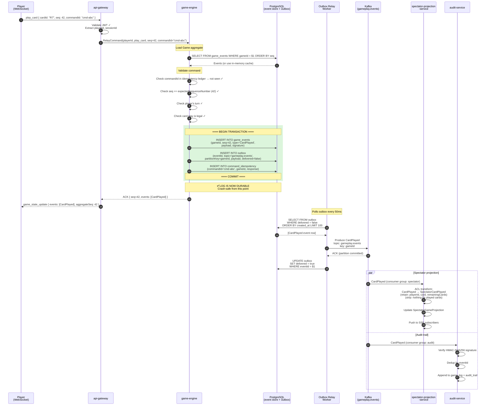

# Sequence Diagram — Log-Before-Broadcast (PlayCard Hot Path)

> **Mandatory intra-context diagram** (§6.1). Shows the Room Gameplay hot path for a `PlayCard` command end-to-end, demonstrating that every authoritative state change is durably appended to the immutable game log **before** any broadcast to players, spectators, or downstream consumers.

---

## Diagram

---

## Crash Recovery Analysis

| Crash Point | Log State | Broadcast State | Client Sees | Recovery |
|-------------|-----------|-----------------|-------------|----------|
| **Before COMMIT** (steps 8–10) | ❌ Not persisted | ❌ Not broadcast | Nothing (no ACK) | TX rolls back. Client retries with same `commandId` → idempotent processing. |
| **After COMMIT, before ACK** (step 11) | ✅ Persisted | ❌ Not broadcast yet | No ACK → client may retry | Client retries with same `commandId` → idempotency ledger returns cached response. Outbox relay publishes event on next poll. |
| **After ACK, before Kafka publish** (step 14) | ✅ Persisted | ❌ Not yet in Kafka | Player sees ACK ✓ | Outbox relay picks up on next poll (50 ms) or on restart. Event reaches Kafka. At-least-once. |
| **After Kafka publish, before outbox mark** (step 16) | ✅ Persisted | ✅ In Kafka | Player sees ACK ✓ | Outbox relay retries → duplicate publish. Consumers deduplicate by `eventId`. |
| **Consumer crashes** (step 17+) | ✅ Persisted | ✅ In Kafka | Player sees ACK ✓ | Kafka retains event. Consumer redelivers on restart. Consumer deduplicates by `eventId`. |

### Key Guarantee

**No client ever sees an update that isn't in the log.** The WebSocket ACK (step 11) happens strictly **after** COMMIT (step 10). If the process crashes between steps 8 and 10, the TX rolls back — the event never existed.

### Why Transactional Outbox (Not Direct Kafka Produce)

Direct Kafka produce cannot be made atomic with the PostgreSQL event store write. Two failure modes:
1. **DB commit succeeds, Kafka fails:** Event is logged but never broadcast (consumers miss it).
2. **Kafka succeeds, DB commit fails:** Event is broadcast but never logged (violates log-before-broadcast).

The transactional outbox eliminates both: the outbox row and event store row are in the **same TX**. The relay worker handles Kafka publication asynchronously with at-least-once semantics.
