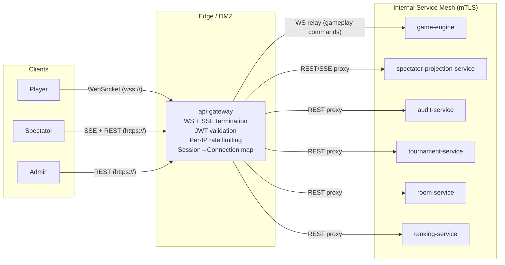
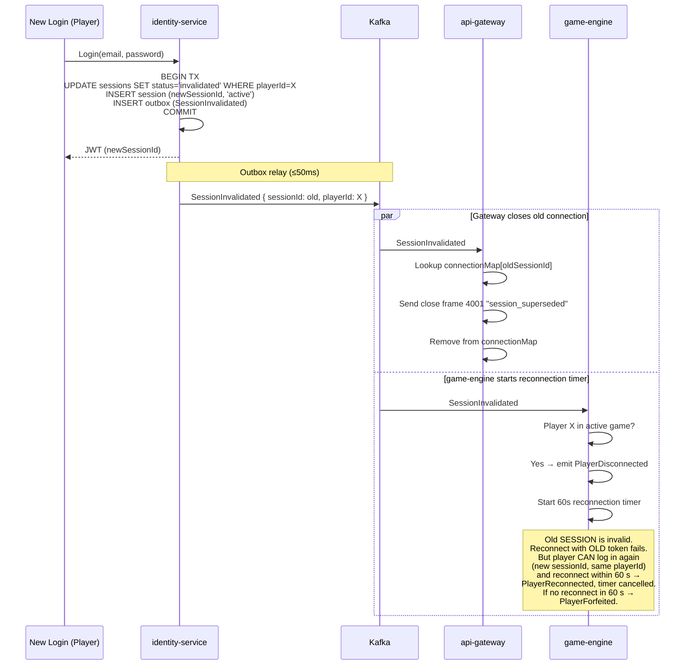

# 5. Client Connection Model

> Declares the client-to-server connection strategy for UnoArena: protocol choices, connection lifecycle, session invalidation composition, spectator privacy enforcement, and reconnection behavior. Corresponds to §6.3 of the Architecture Checkpoint.

---

## 5.1 Connection Model Overview

| Client Type | Protocol | Auth | Termination Point | Upstream Service | Purpose |
|-------------|----------|------|-------------------|-----------------|---------|
| **Player** | WebSocket (`wss://`) | Bearer JWT (validated on upgrade) | `api-gateway` | `game-engine` (relay) | Bidirectional gameplay: commands (PlayCard, DrawCard, CallUno…) + real-time updates (game state events) |
| **Spectator** | SSE (`https://`) + REST | Optional Bearer JWT (`role: player` or above); required when room is `visibility = "private"` | `api-gateway` | `spectator-projection-service` | Read-only live game feed + lobby/bracket queries |
| **Admin** | REST (`https://`) | Bearer JWT (`role: admin/operator/compliance`) | `api-gateway` | `audit-service`, `tournament-service` | Audit queries, tournament management, force-resolve |

---

## 5.2 Why This Model

### WebSocket for Players

1. **Bidirectional necessity** — Players send commands (`play_card`, `draw_card`, `call_uno`) and receive updates (`CardPlayed`, `TurnAdvanced`, `GameCompleted`) on the same connection. REST+SSE would require two separate channels with synchronization overhead.
2. **Low latency** — Single persistent connection eliminates per-message HTTP handshake. Sub-100 ms round-trip for gameplay commands.
3. **Sequence-number enforcement** — Commands and ACKs flow over the same channel, enabling the client to track `expectedSequenceNumber` and reconcile on mismatch.
4. **Natural fit** — WebSocket's full-duplex model maps directly to the game state machine's command/event pattern.

### SSE for Spectators

1. **Read-only sufficiency** — Spectators only consume events; they never send commands. SSE's unidirectional server→client model is a natural fit.
2. **HTTP/2 multiplexing** — Multiple SSE streams share a single TCP connection, reducing overhead for spectators watching several games.
3. **CDN/proxy friendliness** — SSE is standard HTTP. Regional edge proxies or CDN layers can cache and fan out SSE streams without WebSocket upgrade support.

### Room Visibility and Spectator Authentication

To support friends-only / unlisted casual rooms and reduce credential-free metadata scraping, rooms carry a `visibility` attribute set at creation by the host:

| Visibility | Lobby Listing | Spectator Auth | Notes |
|------------|---------------|----------------|-------|
| `public` | Listed in `/lobby/rooms` | None (anonymous SSE allowed, per-IP limited) | Default for casual rooms; same behavior as before this fix. |
| `unlisted` | Not listed; reachable only via shared link containing `roomId` | None (anonymous allowed if `roomId` known) | "Friends-with-link" sharing. |
| `private` | Not listed | Bearer JWT required; spectator `playerId` must appear on the host-managed invitee list (stored on the Room aggregate) | "Friends-only" — `spectator-projection-service` checks invitee list before opening the SSE stream. |
| `tournament` | Not listed in casual lobby; surfaced via bracket projection | None for spectators; reads still subject to per-IP limits | Existing behavior. |

`room-service` enforces `visibility` at room creation; `spectator-projection-service` enforces it on `GET /spectator/games/{id}` and `GET /spectator/games/{id}/stream`. Lobby projection (`AvailableRooms`) only includes `visibility = "public"`. This also restricts the surface area for anonymous metadata scraping (active games, card counts) to `public` rooms.
4. **Built-in reconnection** — `EventSource` API auto-reconnects with `Last-Event-ID`, simplifying client-side recovery.
5. **No auth overhead** — Public spectator streams don't need JWT validation per message, only per-IP rate limiting.

### REST for Non-Realtime

Standard request/response for CRUD operations: registration, login, room creation, leaderboard queries, audit queries. No persistent connection needed.

---

## 5.3 Connection Topology



---

## 5.4 Connection Lifecycle

### 5.4.1 Player WebSocket

**Establishment:**
1. Client sends HTTP Upgrade request to `wss://api.unoarena.com/ws/games/{gameId}` with `Authorization: Bearer <JWT>`.
2. `api-gateway` validates JWT (Redis session cache → `identity-service` fallback).
3. On valid token: complete WebSocket upgrade. Store `(sessionId → connectionRef)` in gateway's in-memory connection map.
4. Gateway associates connection with `gameId` for routing.

**Message Format (JSON text frames):**

```json
// Client → Server (command)
{
  "type": "play_card",
  "commandId": "uuid-v4",
  "sequenceNumber": 42,
  "payload": { "cardId": "R7" }
}

// Server → Client (state update)
{
  "type": "game_state_update",
  "events": [
    { "eventType": "CardPlayed", "aggregateSequence": 42, "payload": { ... } },
    { "eventType": "TurnAdvanced", "aggregateSequence": 43, "payload": { ... } }
  ]
}

// Server → Client (rejection)
{
  "type": "command_rejected",
  "commandId": "uuid-v4",
  "reason": "stale_sequence_number",
  "expected": 43
}
```

**Per-Room Ordering Guarantee:**
1. `game-engine` writes events to event store with monotonic `sequenceNumber` per Game aggregate.
2. Outbox relay publishes to Kafka `gameplay.events` partitioned by `gameId` — total ordering within partition.
3. WebSocket messages to the player include events ordered by `aggregateSequence`.
4. Client tracks last-seen `aggregateSequence`. On gap → requests full state snapshot via REST (`GET /games/{gameId}/state`).

**Heartbeat:**
- Gateway sends WebSocket ping every 30 seconds.
- On pong: gateway revalidates JWT against Redis session cache.
- Stale token detected → send close frame (code 4001: `session_superseded`).
- No pong within 10 s → assume client disconnected. Notify `game-engine` → `PlayerDisconnected`.

**Graceful Disconnection:**

| Close Code | Meaning | Client Action |
|------------|---------|---------------|
| 1000 | Normal closure (game ended, player left) | No retry |
| 4001 | Session superseded (new login elsewhere) | Re-authenticate with new session |
| 4002 | Game not found | Show error |
| 4029 | Rate limited | Backoff, retry |
| 1006 | Abnormal closure (network error) | Reconnect with exponential backoff |

### 5.4.2 Spectator SSE

**Establishment:**
1. Client opens `EventSource` to `https://api.unoarena.com/api/v1/spectator/games/{gameId}/stream`.
2. `api-gateway` checks per-IP SSE connection limit (max 20). No JWT required.
3. Gateway proxies to `spectator-projection-service`.
4. Service sends current projection snapshot as first SSE event, then streams incremental updates.

**SSE Event Format:**

```
id: evt-uuid-1234
event: SpectatorCardPlayed
data: {"playerId":"P1","card":{"color":"red","face":"7"},"remainingCards":3,"timestamp":"..."}

id: evt-uuid-1235
event: SpectatorTurnAdvanced
data: {"currentPlayer":"P2","direction":"clockwise","timestamp":"..."}
```

**Keepalive:** SSE comment (`: keepalive`) every 15 seconds to prevent proxy/load-balancer timeout.

**Backpressure:** Each SSE connection has a bounded write buffer (64 KB). If a client falls behind (buffer full for > 5 seconds), the connection is terminated with a keepalive timeout. The client's `EventSource` auto-reconnects with `Last-Event-ID`, receiving a snapshot + delta from the materialized projection. This bounds per-connection memory to ~64 KB regardless of client speed, preventing slow clients from consuming unbounded server memory at scale.

**Ordering:** Events are delivered in `aggregateSequence` order (inherited from Kafka partition ordering by `gameId`). `id` field enables `Last-Event-ID` reconnection.

---

## 5.5 Session Invalidation Composition

When a player logs in on a new device, the old session must lose its WebSocket/SSE connection promptly.



**Latency:** Old connection closed within ~200 ms of new login (Kafka consumer lag).

**Fallback:** If gateway misses the Kafka event (consumer lag spike), the 30 s heartbeat token revalidation catches the stale session.

**Game participation is bound by `playerId`, not `sessionId`.** The 60-second reconnection timer runs against the Player's game slot, not the session. A player who inadvertently logged in from a second device (superseding their first session) can re-authenticate via REST and rejoin the same game with a fresh JWT carrying the same `playerId` within the 60-second window. The `Reconnect` command is accepted based on `playerId` membership, not session continuity. Only if no reconnect arrives within 60 seconds does `PlayerForfeited` fire.

**Per-Connection-Type Impact:**

| Connection Type | Impact | Recovery |
|----------------|--------|----------|
| Player WebSocket | Close frame 4001 sent. Game-engine starts 60 s timer for the Player's game slot. | Player re-authenticates (new session, same `playerId`), sends `reconnect { gameId }` within 60 s. Timer cancelled on success. |
| Spectator SSE | SSE streams are public (no session). Unaffected. | N/A |
| REST request | Next request with old token → 401 at gateway. | Client refreshes auth. |

---

## 5.6 Spectator Privacy Enforcement

Spectators **never** receive hand contents, draw pile state, deck seed, sequence numbers, or event signatures. This is enforced at four levels:

### Level 1: Separate Route

Spectators connect to `/api/v1/spectator/games/{gameId}/stream` (SSE). Players connect to `/ws/games/{gameId}` (WebSocket). Different `api-gateway` routes direct to different upstream services. A spectator cannot access the player route without a valid JWT for that game.

### Level 2: ACL-Filtered Read Model

`spectator-projection-service` consumes `gameplay.events` from Kafka and applies Anti-Corruption Layer transformations:

| Source Event | Spectator Event | Stripped |
|-------------|----------------|----------|
| `CardDrawn { cardId, card }` | `SpectatorCardDrawn { playerId, newCardCount }` | Card identity |
| `GameStarted { hands, deckSeed }` | `SpectatorGameStarted { playerNames, cardCounts }` | All hand contents, deck seed |
| `ChallengeResolved { penaltyCards }` | `SpectatorChallengeResolved { outcome, penaltyCount }` | Penalty card identities |
| `WDFChallengeResolved { handSnapshot }` | `SpectatorWDFChallengeResolved { outcome }` | Hand snapshot for adjudication |

### Level 3: Separate Storage

The spectator read model (PostgreSQL/MongoDB) contains **only** spectator-safe projections. Raw gameplay events are never stored. Even a full DB compromise reveals no hand data.

### Level 4: No Subscription Crossover

Gateway routing ensures spectator SSE endpoints serve data exclusively from `spectator-projection-service`. There is no path from a spectator connection to `game-engine` data. The `spectator-projection-service` itself never stores or forwards private fields.

---

## 5.7 Reconnection Strategy

**Foundational rule: game participation is bound by `playerId`, not `sessionId`.** A player is identified as a game participant by their `playerId` (from the JWT claim). Session rotation (logging in from a new device, thereby superseding the old session) does not forfeit game participation — the 60-second reconnection window runs against the Player's game slot and is cancelled by a `Reconnect` command carrying any valid JWT with the same `playerId`, regardless of which `sessionId` it carries.

### Player WebSocket Reconnection

1. **Client-side:** Exponential backoff with jitter — 1 s, 2 s, 4 s, 8 s (max 30 s). On reconnect:
   - If old JWT is still valid → reuse. If expired (or superseded) → re-authenticate via REST (`POST /sessions`). The new JWT carries the same `playerId` but a new `sessionId`.
   - Send `reconnect { gameId }` command over new WebSocket.

2. **Server-side:** `game-engine` receives `Reconnect` command:
   - Verify JWT's `playerId` is a participant in `gameId` and reconnection window is still open (within 60 s of `PlayerDisconnected`).
   - The `sessionId` in the new JWT may differ from the one that was playing before — this is expected and accepted (session rotation does not forfeit the game slot).
   - Emit `PlayerReconnected`. Cancel 60 s timer (version increment on `timer_deadlines`).
   - Send full game state snapshot (replayed from event store) over WebSocket.
   - Client reconciles `aggregateSequence` — events since last-seen are replayed.

3. **Non-reconnectable scenarios:**

| Close Code | Reconnectable? | Reason |
|------------|---------------|--------|
| 4001 (session superseded) | No — re-auth required | New session replaced old |
| 4002 (game not found) | No | Game ended or invalid ID |
| 1006 (network error) | Yes | Transient failure |
| 1000 (normal close) | No | Intentional disconnection |

### Spectator SSE Reconnection

1. **Automatic:** Browser `EventSource` API reconnects with `Last-Event-ID` header.
2. `spectator-projection-service` checks if `Last-Event-ID` is within projection history:
   - Yes → replay events since that ID.
   - No (gap too large or projection reset) → send full projection snapshot as first event.
3. No auth needed. Per-IP rate limit still applies on reconnection.

---

## 5.8 Scaling Considerations

### Connection Estimates (Peak — First Tournament Round)

| Metric | Value | Derivation |
|--------|-------|------------|
| Player WebSocket connections | ~1,000,000 | 1M tournament players |
| Spectator SSE connections | ~5,000,000 | 5:1 average spectator ratio |
| Total long-lived connections | ~6,000,000 | Sum |
| Gateway instances | ~600 | 10k connections/instance |

### Horizontal Gateway Scaling

- `api-gateway` is stateless (session map in Redis, connection map in memory per instance).
- `SessionInvalidated` events consumed by every gateway instance (each checks its local `connectionMap`).
- **Player WebSocket → `game-engine` relay uses consistent-hash routing keyed by `gameId`** (extracted from the `/ws/games/{gameId}` URL path on upgrade). This is the deployed mode, not an option: the outbox-relay partition-exclusive ownership in `03-bounded-contexts/room-gameplay.md` §Internal-Only Interfaces and the in-memory aggregate cache budget in `11-nfr-matrix.md` §11.1.1 both rely on every command for a given `gameId` landing on the same `game-engine` instance for the lifetime of that game. Gateway → game-engine pinning is rebalanced only on instance loss; on rebalance the new instance rebuilds the aggregate from the event store and `SKIP LOCKED` on the outbox relay prevents double publish during the transient overlap.
- All **non-gameplay** REST and SSE routes (REST proxies to `identity-service`, `room-service`, `tournament-service`, `ranking-service`, `audit-service`, `spectator-projection-service`) use plain round-robin load balancing — no affinity required.
- Rate limiting Layer 3 is Redis-backed by default (`06-rate-limiting.md` §6.4); the local-memory fast-path is enabled only because `gameId` consistent hashing is the configured mode for the gameplay path.

### Spectator Fan-Out

- Average room: ~50 spectators. 100k rooms × 50 = 5M SSE connections.
- Popular rooms (tournament finals): up to 100,000+ spectators.
- For high-fan-out rooms: **regional edge proxies** that subscribe to one upstream SSE and fan out to local spectators. Edge multiplexes: 1 upstream connection per game → N downstream connections.
- Fan-out ratio per edge instance: up to 10,000 SSE connections.
