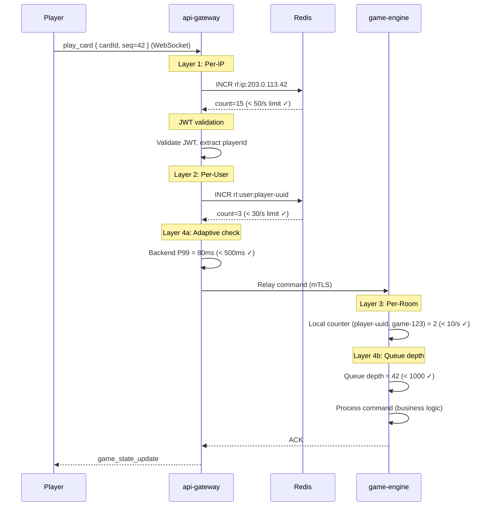

# 6. Rate Limiting Architecture

> Maps multi-layer rate limiting to concrete deployables per §6.3 of the Architecture Checkpoint. Each layer defends against a distinct threat class, and together they form a defense-in-depth chain from edge to service.

---

## 6.1 Overview

Rate limiting is enforced at four layers, each progressively closer to business logic:

```
┌──────────────────────────────────────────────────────────────────┐
│                        PUBLIC INTERNET                           │
└──────────────────────────┬───────────────────────────────────────┘
                           │
                    ┌──────▼──────┐
                    │ LAYER 1     │  Per-IP token bucket (Redis)
                    │ api-gateway │  Before authentication
                    │ (edge)      │  Defense: DDoS, brute-force
                    └──────┬──────┘
                           │ JWT validated
                    ┌──────▼──────┐
                    │ LAYER 2     │  Per-User sliding window (Redis)
                    │ api-gateway │  After JWT validation
                    │ (post-auth) │  Defense: authenticated abuse
                    └──────┬──────┘
                           │ mTLS / private network
            ┌──────────────▼──────────────┐
            │ LAYER 3                      │  Per-Room/Tournament action
            │ game-engine, room-service,   │  In-process middleware
            │ tournament-service           │  Defense: game-level abuse
            └──────────────┬──────────────┘
                           │
            ┌──────────────▼──────────────┐
            │ LAYER 4                      │  Adaptive throttling
            │ api-gateway + services       │  Latency-based shedding
            │                              │  Defense: cascade failure
            └─────────────────────────────┘
```

**Principle:** Each layer operates independently. A request must pass all layers to reach business logic. Earlier layers are cheaper (no DB, no business context) and shed the most traffic.

---

## 6.2 Layer 1: Per-IP (Edge / API Gateway)

| Attribute | Value |
|-----------|-------|
| **Deployable** | `api-gateway` — Nginx/Envoy rate-limiting module |
| **Identity** | Source IP address (from TCP connection or `X-Forwarded-For` with trusted proxy chain) |
| **Scope** | Global per IP, applied **before** authentication |
| **Algorithm** | Token bucket in Redis |
| **Store** | Redis — key: `rl:ip:{sourceIP}`, TTL: 60 s |

### Limits

| Endpoint Class | Limit | Rationale |
|---------------|-------|-----------|
| REST API requests | 100 req/s per IP | General abuse prevention |
| WebSocket messages | 50 msg/s per IP | Prevent command flooding |
| SSE connections (anonymous / public rooms) | 20 concurrent per IP | Prevent connection exhaustion. **NAT / tournament household note:** 20 connections from one IP is a plausible legitimate scenario (e.g., 4 household members × 5 tabs each during tournament finals). To avoid false throttling: if the SSE request carries a valid Bearer JWT, the connection counts against a **per-(IP, playerId) cap of 5 concurrent SSE streams** rather than the shared per-IP pool — effectively giving each authenticated user 5 personal slots independent of other users behind the same NAT. Anonymous connections (no JWT) share the 20-connection per-IP pool. This separates household spectators without raising the unauthenticated cap. |
| Login attempts (`POST /sessions`) | 10/min per IP | Brute-force credential protection |
| Registration (`POST /players`) | 5/min per IP | Bot registration prevention |

### Exceeded Behavior

- **REST:** HTTP 429 `Too Many Requests` with `Retry-After` header.
- **WebSocket:** Close frame with code 4029 and reason `rate_limit_exceeded`.
- **SSE:** HTTP 429 on new connection attempts (existing connections unaffected).

### Why at This Layer

Per-IP is the only identity available before authentication. Catches volumetric DDoS, credential stuffing, and bot floods before they reach application logic. Zero business-logic cost.

---

## 6.3 Layer 2: Per-User (API Gateway, Post-Auth)

| Attribute | Value |
|-----------|-------|
| **Deployable** | `api-gateway` — custom middleware, executed **after** JWT validation |
| **Identity** | `playerId` extracted from validated JWT claims |
| **Scope** | Per authenticated user, across all endpoints |
| **Algorithm** | Sliding window counter in Redis |
| **Store** | Redis — key: `rl:user:{playerId}`, TTL: sliding window duration |

### How Identity Is Obtained

1. Gateway validates JWT on WebSocket upgrade or REST request.
2. Extracts `playerId` and `sessionId` from token claims.
3. Checks session validity against Redis cache (hot path) or `identity-service` `/sessions/validate` (cache miss, mTLS).
4. After validation, `playerId` is the rate-limit key for Layer 2.

### Limits

| Action Class | Limit | Rationale |
|-------------|-------|-----------|
| Gameplay commands (via WebSocket) | 30 cmd/s | Normal play is ~1-2 cmd/s; 30/s allows bursts but blocks automation |
| REST API requests | 10 req/s | Room creation, queries, etc. |
| Room join attempts | 5/min | Prevent room-hopping abuse |
| Tournament registration | 3/min | Prevent registration spam |

### Exceeded Behavior

- **REST:** HTTP 429 with `Retry-After`.
- **WebSocket:** Error frame `{ type: "command_rejected", reason: "rate_limited", retryAfterMs: 1000 }`.

### Why at This Layer

Catches abuse from authenticated users: automated play bots, rapid command spam, account sharing. Per-IP alone doesn't stop a distributed attacker using many IPs with stolen credentials.

---

## 6.4 Layer 3: Per-Room/Tournament Action (Service-Level)

| Attribute | Value |
|-----------|-------|
| **Deployable** | In-process middleware within `game-engine`, `room-service`, `tournament-service` |
| **Identity** | `playerId` from gateway-injected claims + `roomId`/`gameId`/`tournamentId` from request path/payload |
| **Scope** | Per `(playerId, gameId)` for gameplay; per `(playerId, roomId)` for room actions; per `(playerId, tournamentId)` for tournament |
| **Algorithm** | Sliding window counter — Redis-backed (default) with local-memory fast-path when consistent-hash routing by `gameId` is enabled |
| **Store** | Redis cluster (shared with Layer 1/2). Local memory used only when partition affinity is guaranteed by the gateway. |

### Counter Placement

The original design assumed the gateway routes every WebSocket for a given `gameId` to the same `game-engine` instance, allowing a process-local counter to be authoritative. The gateway, however, uses round-robin load balancing by default (`05-client-connection-model.md` §5.8) — consistent-hash routing is not guaranteed. A pure local counter therefore under-counts when a player's two commands land on different `game-engine` instances, and the per-room/per-challenge caps become unenforceable. To close this gap:

- **Default mode (required for §6.3 conformance):** Layer 3 per-`(playerId, gameId)` and per-`(playerId, roomId)` counters are stored in the shared **Redis cluster** with key schema `rl:room:{playerId}:{gameId}` and `rl:room:{playerId}:{roomId}`. Sliding-window algorithm, TTL = window duration. This guarantees the cap holds regardless of which `game-engine` instance handles the command. The ~0.3–0.5 ms Redis round-trip is acceptable on the gameplay hot path because Layers 1 and 2 already touch Redis on the same request.
- **Fast-path optimization (optional):** When the gateway is configured for consistent-hash routing keyed on `gameId` (deployable configuration in `05-client-connection-model.md` §5.8), `game-engine` may use a process-local sliding window as a cache, falling back to Redis on cold start or instance loss. This is an optimization, not a correctness requirement.
- **Sequence-number and turn invariants** continue to be enforced by the Game aggregate regardless of routing.

This preserves Layer 3 as a defense-in-depth layer even in the absence of partition affinity, restoring the four-layer guarantee required by §6.3 and the D-1/D-3 mitigations in `12-threat-model.md`.

### How Scope Is Obtained

1. Gateway injects `playerId` into request context (trusted, post-auth).
2. `gameId` / `roomId` comes from the WebSocket message payload or REST URL path.
3. Rate limiter keys on `(playerId, gameId)` or `(playerId, roomId)`.

### Limits

| Action | Limit | Rationale |
|--------|-------|-----------|
| Gameplay commands per player per game | 10 cmd/s | Normal play: ~1-2/s. Allows fast legitimate play. Blocks bots. |
| Challenges (Uno/WDF) per player per game | 3 per 5 s window | Prevent challenge spam during challenge windows |
| Room join per room | 2 attempts/min | Prevent join/leave cycling |
| Tournament actions per player | 5/min | Registration, status queries |

### Exceeded Behavior

`CommandRejected { reason: "rate_limited", commandId, retryAfterMs }` — sent over WebSocket or as HTTP 429.

---

## 6.5 Layer 4: Adaptive Throttling

Adaptive throttling responds to system-wide load signals, not individual user behavior. It protects against cascade failures and resource exhaustion during peak load (tournament surges).

### 4a. Gateway Latency-Based Shedding

| Attribute | Value |
|-----------|-------|
| **Deployable** | `api-gateway` |
| **Signal** | Backend P99 response latency (measured per upstream service) |
| **Threshold** | P99 > 500 ms for gameplay services; P99 > 2 s for other services |
| **Action** | Shed traffic by priority tier (lowest priority first) |

**Priority Tiers (highest to lowest):**

| Tier | Traffic Type | Shed Under Load? |
|------|-------------|------------------|
| 1 (Critical) | Gameplay commands (PlayCard, DrawCard, CallUno) | Never shed |
| 2 (High) | Room management (Create, Join, Leave, Forfeit) | Last resort only |
| 3 (Medium) | Tournament registration, status queries | Shed when P99 > 1 s |
| 4 (Low) | Spectator SSE new connections | Shed when P99 > 500 ms |
| 5 (Lowest) | Leaderboard queries, player stats | Shed first |

### 4b. Service-Level Queue Depth

| Attribute | Value |
|-----------|-------|
| **Deployable** | `game-engine` |
| **Signal** | Internal command queue depth per instance |
| **Threshold** | Queue > 1,000 pending commands |
| **Action** | Reject new commands with `CommandRejected { reason: "server_busy" }` (HTTP 503 equivalent) |

### 4c. Tournament Kickoff Backpressure

| Attribute | Value |
|-----------|-------|
| **Deployable** | `round-kickoff-worker` |
| **Signal** | `room-service` consumer lag on `tournament.rooms` Kafka topic |
| **Threshold** | Consumer lag > 5,000 messages |
| **Action** | Reduce publish rate from 1,000 rooms/sec/shard to 500, then 250. Resume normal rate when lag < 1,000. |

### 4e. Identity-Service Adaptive Throttling (D-1)

| Attribute | Value |
|-----------|-------|
| **Deployable** | `identity-service` (directive writer) + `api-gateway` (directive enforcer) |
| **Signal** | Repeated failed logins, anomalous session creation rate, or explicit suspension/ban event from `identity-service` |
| **Mechanism** | `identity-service` writes a short-lived throttle directive to Redis (`rl:adaptive:{targetType}:{targetId}`). `api-gateway` reads this key on every authenticated request (same Redis call as Layer 2 counter — no extra network hop). On hit, applies the escalated limit tier (`strict` or `block`). |
| **Failure mode** | Redis unavailable → directive skipped (fail-open; availability preferred over throttling). Layer 1 per-IP and Layer 2 per-user limits remain active. |

This wires the D-1 mitigation from `12-threat-model.md`: adaptive per-offender throttling is now a concrete, traceable mechanism rather than a stated intent. See `identity-session.md` §Internal-Only Interfaces — Throttle Directives for trigger thresholds and directive schema.

### 4d. Circuit Breaker

| Attribute | Value |
|-----------|-------|
| **Deployable** | `api-gateway` and inter-service RPC callers |
| **Signal** | Error rate > 50% over 30 s window |
| **Action** | Open circuit → return 503 for 30 s → half-open (allow 10% traffic) → close if success rate > 90% |

---

## 6.6 Shared Infrastructure

### Redis Configuration

- **Cluster:** Shared Redis cluster for rate-limit counters (same cluster as session cache and leaderboard).
- **Key Schema:** `rl:{layer}:{scope}:{identifier}`
  - `rl:ip:203.0.113.42` — Layer 1, per-IP
  - `rl:user:player-uuid-1234` — Layer 2, per-user
- **TTL:** Keys expire after the window duration (1 min for most, 5 min for login). Automatic cleanup.
- **Consistency:** Best-effort. Redis is not strongly consistent — a counter may under-count by 1-2 in split-brain scenarios. Acceptable for rate limiting (false negatives are harmless; false positives are rare and self-correcting after TTL).

### Layer 3 Store: Redis (default), Local-Memory Fast-Path (optional)

- **Default:** Redis-backed sliding window (see §6.4 "Counter Placement"). Required when the gateway uses round-robin or any non-affinity routing.
- **Fast-path:** When the gateway is explicitly configured for consistent-hash routing keyed by `gameId`, a process-local counter may be used as a cache for the Redis-backed authoritative window, saving ~0.3–0.5 ms per command.
- On instance restart in fast-path mode, the local cache is rebuilt from Redis on first hit; in default mode, no warming is needed.

---

## 6.7 Request Flow Example

A `play_card` command traverses all four layers:



---

## 6.8 Summary Table

| Layer | Deployable | Identity Source | Scope | Algorithm | Store | Key Limits |
|-------|-----------|----------------|-------|-----------|-------|------------|
| **1. Per-IP** | `api-gateway` (Nginx/Envoy) | Source IP | Global per IP | Token bucket | Redis | 100 req/s REST, 50 msg/s WS, 20 SSE, 10 login/min |
| **2. Per-User** | `api-gateway` (post-auth middleware) | `playerId` from JWT | Per authenticated user | Sliding window | Redis | 30 cmd/s gameplay, 10 req/s REST, 5 joins/min |
| **3. Per-Room** | `game-engine`, `room-service`, `tournament-service` | `playerId` + `gameId`/`roomId` from request | Per (player, game/room) | Sliding window | Redis (default); local memory only when consistent-hash routing by `gameId` is enabled | 10 cmd/s per game, 3 challenges/5s |
| **4. Adaptive** | `api-gateway` + all services | System-wide signals | Global | Latency/queue thresholds | N/A | Priority-based shedding, backpressure, circuit breaker |
