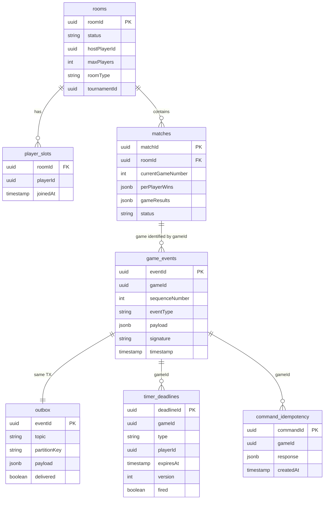

# 7. Persistence Layer Per Context

> Specifies the primary store, consistency model, read models, and retention policy for each bounded context. Corresponds to §6.4 of the Architecture Checkpoint.

---

## 7.1 Design Principle: Database-Per-Context

Every bounded context owns its own PostgreSQL database (or dedicated store). No cross-context joins. Cross-context data flows exclusively via Kafka events. This ensures:

1. **Independent schema evolution** — each context migrates without coordinating with others.
2. **Independent scaling** — Room Gameplay needs high write throughput; Identity & Session is read-heavy.
3. **Fault isolation** — a runaway query in audit does not lock tables in gameplay.
4. **Enforced bounded context boundaries** — accidental coupling via shared tables is structurally impossible.

---

## 7.2 Identity & Session (IS)

### Primary Store

| Technology | Tables | Data Owned |
|-----------|--------|------------|
| PostgreSQL | `player_identities` | `playerId`, credentials (Argon2id hash), `displayName` (unique), `email` (unique), `status` (active/suspended/banned), `createdAt` |
| | `sessions` | `sessionId`, `playerId`, `status` (active/invalidated), `expiresAt`, `deviceFingerprint`, `createdAt` |
| | `outbox` | Transactional outbox for `SessionInvalidated`, `PlayerRegistered`, etc. |
| | `command_idempotency` | `commandId` → cached response. TTL: 24 h. |

### Consistency Model

- **Isolation level:** `SERIALIZABLE` for the session CAS (compare-and-swap) operation on login:
  ```sql
  BEGIN SERIALIZABLE;
  UPDATE sessions SET status = 'invalidated'
    WHERE playerId = $1 AND status = 'active';
  INSERT INTO sessions (sessionId, playerId, status, expiresAt) VALUES (...);
  INSERT INTO outbox (eventId, topic, payload) VALUES (...);
  COMMIT;
  ```
- This guarantees no window where two sessions are simultaneously active for the same player.
- All other operations use `READ COMMITTED` (sufficient for registration, logout).

### Read Models / Caches

| Read Model | Technology | Staleness | Mechanism |
|------------|-----------|-----------|-----------|
| Hot session cache | Redis (key: `session:{sessionId}`) | ≤ 100 ms | Write-through on session creation. Invalidated on `SessionInvalidated` event. TTL = session expiry. |

### Retention

- `player_identities`: Lifetime of account. Soft-delete on ban (PII retained for compliance, flagged).
- `sessions`: Active sessions kept live. Invalidated sessions pruned after 30 days.
- `command_idempotency`: TTL 24 h, pruned by scheduled job.

---

## 7.3 Room Gameplay (RG)

### Primary Store

| Technology | Tables | Data Owned |
|-----------|--------|------------|
| PostgreSQL | `game_events` | `eventId`, `gameId`, `sequenceNumber`, `eventType`, `payload` (JSONB), `signature` (HMAC-SHA256), `timestamp`. **Append-only.** Partitioned by `gameId`. |
| | `outbox` | `eventId`, `topic`, `partitionKey`, `payload`, `delivered` (boolean). Shared TX with `game_events`. |
| | `rooms` | `roomId`, `status`, `hostPlayerId`, `maxPlayers`, `roomType` (casual/tournament), `tournamentId`, `createdAt` |
| | `player_slots` | `roomId`, `playerId`, `joinedAt` |
| | `matches` | `matchId`, `roomId`, `currentGameNumber`, `perPlayerWins` (JSONB), `gameResults` (JSONB), `status` |
| | `timer_deadlines` | `deadlineId`, `gameId`, `type` (uno_challenge/wdf_challenge/reconnection/turn_timer), `playerId`, `expiresAt`, `version`, `fired` (boolean) |
| | `command_idempotency` | `commandId`, `gameId`, `response`, `createdAt`. TTL: 24 h. |

### Consistency Model

- **Event store writes:** Single PostgreSQL transaction per command:
  ```sql
  BEGIN;
  INSERT INTO game_events (gameId, sequenceNumber, eventType, payload, signature, timestamp) VALUES (...);
  INSERT INTO outbox (eventId, topic, partitionKey, payload, delivered) VALUES (..., false);
  -- Timer deadline (if applicable):
  INSERT INTO timer_deadlines (deadlineId, gameId, type, expiresAt, version, fired) VALUES (...);
  COMMIT;
  ```
- **Sequence-number uniqueness:** `UNIQUE (gameId, sequenceNumber)` on `game_events` prevents duplicate events.
- **Optimistic concurrency:** The Game aggregate's `expectedSequenceNumber` is the concurrency guard. No row-level locks needed — sequential writes per game.

### Log-Before-Broadcast Mechanism

The **transactional outbox** ensures log-before-broadcast:

1. **Same TX:** `game_events` INSERT + `outbox` INSERT in one PostgreSQL transaction.
2. **COMMIT** = log is durable. Client ACK sent after COMMIT.
3. **Outbox relay worker** (within each `game-engine` instance) polls `outbox WHERE delivered = false AND gameId IN (<instance's shard range>)` every 50 ms using `SELECT … FOR UPDATE SKIP LOCKED` (PostgreSQL advisory lock, prevents duplicate processing during rolling restarts or shard rebalancing). Publishes to Kafka, marks `delivered = true`. Partition-exclusive ownership means parallel pollers query disjoint row sets by design; `SKIP LOCKED` is the safety net for transient overlaps.

**Crash scenarios:**

| Crash Point | Log State | Broadcast State | Recovery |
|-------------|-----------|-----------------|----------|
| Before COMMIT | Not persisted | Not broadcast | TX rolls back. Client retries with same `commandId` (idempotent). |
| After COMMIT, before ACK | Persisted ✓ | Not yet broadcast | Client reconnects, reconciles via sequence number. Outbox relay publishes on next poll. |
| After COMMIT, before Kafka publish | Persisted ✓ | Not yet broadcast | Outbox relay picks up on restart. At-least-once delivery. |
| After Kafka publish, before outbox mark | Persisted ✓ | Broadcast ✓ | Duplicate publish on next poll. Consumers deduplicate by `eventId`. |

### Read Path for Immutable Game Log (Dispute Resolution)

The `game_events` table is the authoritative source for game replay and dispute resolution.

**Who may query:**

| Actor | Access Path | Authorization | Purpose |
|-------|------------|---------------|---------|
| Support agents | `audit-service` API: `GET /audit/games/{gameId}/log` | `role: operator` in JWT | Player disputes game outcome |
| Platform admins | `audit-service` API: `GET /audit/trail` | `role: admin` in JWT | Cross-game investigation |
| Anti-cheat system | `audit-service` API: `GET /audit/games/{gameId}/replay` | Internal mTLS (service-to-service) | Collusion detection, statistical analysis |
| Compliance / legal | `audit-service` API: `POST /audit/trail/export` | `role: compliance` in JWT (break-glass, meta-audited) | Legal data requests |

**Access control:**
- No direct DB access for any human actor. All queries go through `audit-service` scoped APIs.
- `audit-service` reads from a read replica of `game_events` (or its own ingested copy in `game_log`).
- Every audit query is itself logged in the audit trail (meta-audit).

### Read Models / Caches

| Read Model | Technology | Staleness | Mechanism |
|------------|-----------|-----------|-----------|
| Game state cache | In-memory (per `game-engine` instance) | Real-time | Materialized from event replay. Invalidated on instance loss; rebuilt from `game_events`. |

### Retention

- `game_events`: Append-only. Retained 1 year active, then archived to cold storage (S3/GCS, Parquet format).
- `outbox`: Delivered rows pruned after 24 h.
- `rooms`, `player_slots`, `matches`: Retained while active. Completed rooms archived after 30 days.
- `timer_deadlines`: Fired deadlines pruned after 24 h.
- `command_idempotency`: TTL 24 h.

### Entity Relationships



---

## 7.4 Tournament Orchestration (TO)

### Primary Store

| Technology | Tables | Data Owned |
|-----------|--------|------------|
| PostgreSQL | `tournaments` | `tournamentId`, `name`, `status`, `organizerId`, `config` (JSONB: maxPlayers, playersPerRoom, roundTimeout), `registeredCount`, `createdAt` |
| | `tournament_registrations` | `tournamentId`, `playerId`, `registeredAt` |
| | `tournament_rounds` | `roundId`, `tournamentId`, `roundNumber`, `totalRooms`, `completedRooms`, `status`, `createdAt` |
| | `tournament_room_results` | `roundId`, `roomId` (unique per round), `rankings` (JSONB), `completedAt` |
| | `tournament_brackets` | Player advancement paths, per-round placements |
| | `processed_events` | `eventId` → `timestamp`. Deduplication for consumed Kafka events. |

### Consistency Model

- **Completion counter:** `SERIALIZABLE` isolation for the atomic counter increment:
  ```sql
  UPDATE tournament_rounds
  SET completed_rooms = completed_rooms + 1
  WHERE round_id = $1
  RETURNING completed_rooms, total_rooms;
  ```
- **Idempotency:** `UNIQUE (roundId, roomId)` on `tournament_room_results` prevents duplicate counter increments from redelivered `RoomCompleted` events.
- All other operations: `READ COMMITTED`.

### Read Models / Caches

None. Tournament state is low-volume and queried directly from PostgreSQL. Bracket projections are owned by the Spectator View context.

### Retention

- Tournament data retained for 1 year after completion (historical record).
- Registrations pruned 90 days after tournament completion.
- `processed_events`: Pruned after 7 days.

---

## 7.5 Ranking & Statistics (RK)

### Primary Store

| Technology | Tables | Data Owned |
|-----------|--------|------------|
| PostgreSQL | `player_ratings` | `playerId`, `currentElo`, `gamesRated`, `tournamentPlacementRating`, `updatedAt` |
| | `rating_history` | `playerId`, `gameId`, `oldElo`, `newElo`, `delta`, `timestamp`. Append-only. |
| | `processed_games` | `playerId`, `gameId`. Idempotency guard. `UNIQUE (playerId, gameId)`. |
| | `player_statistics` | `playerId`, `gamesPlayed`, `won`, `lost`, `forfeited`, `abandoned`, `avgPlacement`, `currentStreak`, `longestStreak` |

### Consistency Model

- **Per-player atomic TX:**
  ```sql
  BEGIN;
  UPDATE player_ratings SET currentElo = $newElo, gamesRated = gamesRated + 1 WHERE playerId = $1;
  INSERT INTO rating_history (playerId, gameId, oldElo, newElo, delta) VALUES (...);
  INSERT INTO processed_games (playerId, gameId) VALUES (...);  -- UNIQUE constraint = safety net
  COMMIT;
  ```
- Each player's Elo update is independently atomic. Partial failure (crash after updating player A but before B) → redelivery completes remaining players (A is skipped via idempotency).

### Read Models / Caches

| Read Model | Technology | Staleness | Mechanism |
|------------|-----------|-----------|-----------|
| Global leaderboard | Redis Sorted Set (`leaderboard:global`) | ≤ 1 s | `ZADD` after each `EloUpdated`. `ZRANGEBYSCORE` for top-N. `ZRANK` for player rank. |
| Player rank | Redis `ZRANK` | ≤ 1 s | Direct query. |
| Rating history | PostgreSQL (same DB) | Real-time | Direct query with `playerId` index. |
| Player statistics | PostgreSQL (same DB) | Real-time | Direct query. |

### Retention

- `player_ratings`: Lifetime of account.
- `rating_history`: Append-only, retained indefinitely (audit trail for rating disputes).
- `processed_games`: Pruned after 30 days.
- `player_statistics`: Lifetime of account.

---

## 7.6 Spectator View (SV)

### Primary Store

**Choice: PostgreSQL with JSONB.** MongoDB was considered but rejected in favour of PostgreSQL for the following reasons: (1) operational consistency — all other bounded contexts use PostgreSQL, reducing tooling and credential sprawl; (2) JSONB in PostgreSQL provides efficient document storage with GIN index support for the projection documents; (3) the write rate (~25k UPSERT/s) is well within PostgreSQL capability with connection pooling; (4) document cardinality is bounded — at most 100k active game projections and a few hundred lobby entries at once, far below the scale where MongoDB's horizontal sharding provides meaningful benefit.

| Technology | Tables | Data Owned |
|-----------|--------|------------|
| PostgreSQL (JSONB columns) | `spectator_game_projections` | Denormalized per-game documents: `gameId`, `roomId`, `gamePhase`, `players[]` (with `cardCount`, not hand contents), `discardPile`, `turnDirection`, `currentPlayer`, `matchScore`, `lastEvent`, `updatedAt` |
| | `available_rooms` | Lobby listing: `roomId`, `hostName`, `playerCount`, `maxPlayers`, `createdAt`. Casual rooms only. |
| | `tournament_brackets` | Bracket projection: `tournamentId`, `rounds[]`, player advancement/elimination per round. |

### Consistency Model

- **Eventual.** All data is derived from upstream Kafka events. Staleness ≤ 500 ms (Kafka consumer lag + materialization).
- No strong consistency requirements — spectator data is informational.

### Privacy Enforcement at Storage Level

**No raw gameplay events are stored.** Only ACL-transformed, spectator-safe projections. Even a full database compromise reveals no hand contents, deck seeds, or event signatures.

### Read Models

| Read Model | Source Events | Staleness | Purpose |
|------------|-------------|-----------|---------|
| Spectator Game Projection | `gameplay.events` (ACL-filtered) + `gameplay.games` | ≤ 500 ms | Live spectator view |
| Available Rooms (Lobby) | `gameplay.rooms` (casual only) | ≤ 1 s | Lobby page |
| Tournament Bracket | `tournament.lifecycle` | ≤ 1 s | Bracket visualization |

### Retention

- Game projections: Retained while game is active + 24 h after `GameCompleted` (replay browsing). Then deleted.
- Lobby listings: Real-time only. Completed/filled rooms removed immediately.
- Tournament brackets: Retained 30 days after tournament completion.

---

## 7.7 Audit & Game Log (AL)

### Primary Store

| Technology | Tables | Data Owned |
|-----------|--------|------------|
| PostgreSQL (partitioned) or ClickHouse | `game_log` | `gameId`, `sequenceNumber`, `eventType`, `payload` (full), `signature`, `signatureValid` (boolean), `timestamp`, `correlationId`, `causationId`. Partitioned by `gameId`. Append-only. |
| | `audit_trail` | `entryId`, `sourceContext`, `aggregateType`, `aggregateId`, `eventType`, `payload`, `timestamp`, `correlationId`, `causationId`, `signatureStatus`. Append-only. |
| | `processed_events` | `eventId`. Deduplication index. |
| Vault / secure key store | (N/A) | Per-room HMAC keys. Read-only for `audit-service`. |
| PostgreSQL (dedicated schema) | `compliance_meta_audit` | One row per compliance break-glass query: `officerId`, `endpoint`, `queryParams`, `resultRowCount`, `requestTimestamp`, `ipAddress`, `correlationId`. INSERT-only for `audit-service`; SELECT only for `admin` role. Separate from `audit_trail` to prevent compliance self-redaction. Retention: 5 years minimum. |

### Consistency Model

- **Append-only, at-least-once ingestion.** Events arrive via Kafka consumer group with at-least-once delivery.
- Deduplication via `eventId` in `processed_events` (checked before insert).
- **Within a game:** Events ordered by `sequenceNumber`. `UNIQUE (gameId, sequenceNumber)` enforces ordering invariant.
- **Cross-context:** Events ordered by `timestamp`. Causal ordering reconstructed via `correlationId` + `causationId`.

### Immutability Enforcement

- `game_log` and `audit_trail` have **no UPDATE or DELETE permissions** for the application DB role.
- Database-level triggers reject any UPDATE/DELETE attempt.
- PostgreSQL: row-level security policy enforces INSERT-only.
- ClickHouse: MergeTree engine naturally supports append-only workloads.

### Indexes

| Index | Purpose |
|-------|---------|
| `game_log(gameId, sequenceNumber)` | Game replay in order |
| `audit_trail(sourceContext, aggregateId)` | Per-aggregate history |
| `audit_trail(correlationId)` | Causal chain reconstruction |
| `audit_trail(timestamp)` | Time-range queries |
| `audit_trail(eventType)` | Event-type filtering |

### Retention

- `game_log`: 1 year active → cold storage (S3/GCS, Parquet). Archived logs queryable via compliance export API.
- `audit_trail`: 2 years minimum (compliance requirement). Older entries archived.
- `processed_events`: Pruned after 7 days.

---

## 7.8 Shared Infrastructure

### Redis Usage Per Context

| Context | Redis Key Pattern | Purpose | Consistency |
|---------|------------------|---------|-------------|
| IS | `session:{sessionId}` | Hot session token cache | Eventual (write-through, invalidate on event) |
| Gateway | `rl:ip:{ip}`, `rl:user:{playerId}` | Rate-limit counters | Best-effort |
| RK | `leaderboard:global` (sorted set) | Top-N leaderboard | Eventual (≤ 1 s) |
| RG | `timer:aux:{gameId}` | Timer deadline auxiliary index (optional fast-path) | Derived (authoritative source is PostgreSQL) |

### Kafka

Event backbone for all async integration. See [02-container-view.md](02-container-view.md) §2.2 for topic layout.

---

## 7.9 Cross-Context Data Isolation

| Boundary | Enforcement Mechanism |
|----------|-----------------------|
| Separate databases | Each context has its own PostgreSQL instance (or database with separate credentials). No network route between context databases. |
| No cross-context joins | All cross-context data access is via Kafka events or REST APIs. |
| Schema ownership | Each context owns its schema migrations independently. No shared migration pipeline. |
| Credential isolation | Each service has its own DB credentials with access only to its database. |

---

## 7.10 Summary

| Context | Primary Store | Technology | Consistency | Read Models | Key Retention |
|---------|--------------|-----------|-------------|-------------|---------------|
| Identity & Session | Players, Sessions | PostgreSQL | SERIALIZABLE (CAS) | Redis session cache | Sessions: 30 d |
| Room Gameplay | Event store, Rooms, Matches, Timers | PostgreSQL | Strong (per-game TX) | In-memory game cache | Events: 1 yr → cold |
| Tournament Orchestration | Tournaments, Rounds, Results | PostgreSQL | SERIALIZABLE (counter) | None (direct queries) | 1 yr after completion |
| Ranking & Statistics | Ratings, History, Stats | PostgreSQL | Strong (per-player TX) | Redis leaderboard | History: indefinite |
| Spectator View | Projections, Lobby, Brackets | PostgreSQL (JSONB) | Eventual (≤ 500 ms) | All are read models | Games: 24 h post-complete |
| Audit & Game Log | Game log, Audit trail | PostgreSQL / ClickHouse | Append-only, at-least-once | Indexed by correlationId | Game log: 1 yr; Audit: 2 yr |
