# C4 Container Diagram — UnoArena System

> System-wide container diagram showing all runnable components, infrastructure, trust boundaries, and key data flows.

---

## Diagram

```mermaid
flowchart TB
    subgraph Clients["Clients (Public Internet)"]
        Player["🎮 Player<br/>(WebSocket)"]
        Spectator["👁 Spectator<br/>(SSE + REST)"]
        Admin["🔧 Admin<br/>(REST)"]
    end

    subgraph Edge["Edge / DMZ"]
        GW["api-gateway<br/>─────────────<br/>• WS & SSE termination<br/>• JWT validation<br/>• Per-IP rate limiting (L1)<br/>• Per-User rate limiting (L2)<br/>• Session→Connection map<br/>• Push-invalidation listener"]
    end

    subgraph IS["Identity & Session"]
        IS_SVC["identity-service<br/>─────────────<br/>• Registration, Login<br/>• JWT issuance<br/>• Session CAS<br/>• SessionInvalidated broadcast"]
        IS_DB[("IS PostgreSQL<br/>players, sessions")]
        IS_CACHE[("Redis<br/>session cache")]
    end

    subgraph RG["Room Gameplay"]
        RS["room-service<br/>─────────────<br/>• Room lifecycle<br/>• Match coordination<br/>• Best-of-3 scoreline"]
        GE["game-engine<br/>─────────────<br/>• Event-sourced game state<br/>• Deck/RNG, hands, turns<br/>• Sequence enforcement<br/>• Transactional outbox"]
        TS_TIMER["timer-service<br/>─────────────<br/>• Durable domain timers<br/>• 5s challenge, 60s reconnect<br/>• 30/60s turn timer<br/>• Idempotent expiry"]
        RG_DB[("RG PostgreSQL<br/>event store, outbox,<br/>rooms, matches, timers")]
    end

    subgraph TO["Tournament Orchestration"]
        TO_SVC["tournament-service<br/>─────────────<br/>• Tournament lifecycle<br/>• Round management<br/>• Advancement (top-3)"]
        KW["round-kickoff-worker<br/>─────────────<br/>• Sharded fan-out<br/>• Rate-limited publish<br/>• 100k rooms in ~10s"]
        TO_DB[("TO PostgreSQL<br/>tournaments, rounds,<br/>results, brackets")]
    end

    subgraph RK["Ranking & Statistics"]
        RK_SVC["ranking-service<br/>─────────────<br/>• Elo pipeline (casual only)<br/>• Leaderboard maintenance<br/>• Player statistics"]
        RK_DB[("RK PostgreSQL<br/>ratings, history,<br/>statistics")]
        RK_CACHE[("Redis<br/>leaderboard sorted set")]
    end

    subgraph SV["Spectator View"]
        SP["spectator-projection-service<br/>─────────────<br/>• ACL privacy filter<br/>• Read model materialization<br/>• Lobby, brackets<br/>• SSE feed"]
        REP["regional-edge-proxy<br/>─────────────<br/>• SSE fan-out (1:10k)<br/>• Auto-activated >1k spectators/room<br/>��� Last-Event-ID reconnection<br/>• Per-IP rate limiting"]
        SV_DB[("SV PostgreSQL (JSONB)<br/>spectator projections,<br/>lobby, brackets")]
    end

    subgraph AL["Audit & Game Log"]
        AU["audit-service<br/>─────────────<br/>• Universal event sink<br/>• HMAC verification<br/>• Compliance queries<br/>• Game replay API"]
        AL_DB[("AL PostgreSQL/ClickHouse<br/>game log, audit trail<br/>(append-only)")]
    end

    subgraph Infra["Shared Infrastructure"]
        KAFKA{{"Kafka<br/>Event Backbone<br/>─────────────<br/>identity.sessions<br/>gameplay.events<br/>gameplay.games<br/>gameplay.rooms<br/>gameplay.audit<br/>tournament.lifecycle<br/>tournament.rooms<br/>tournament.kickoff-work<br/>tournament.rooms.dlq<br/>ranking.updates"}}
    end

    %% Client → Gateway
    Player -- "wss:// (gameplay)" --> GW
    Spectator -- "https:// (SSE + REST)" --> GW
    Admin -- "https:// (REST)" --> GW

    %% Gateway → Services
    GW -- "REST: login, register" --> IS_SVC
    GW -- "WS relay: game commands" --> GE
    GW -- "REST: room create/join" --> RS
    GW -- "REST: tournament mgmt" --> TO_SVC
    GW -- "REST: leaderboard" --> RK_SVC
    GW -- "REST/SSE: spectator" --> SP
    GW -- "SSE: high-fan-out rooms" --> REP
    REP -- "1 upstream SSE per game" --> SP
    GW -- "REST: audit queries" --> AU

    %% Identity flows
    IS_SVC --> IS_DB
    IS_SVC --> IS_CACHE
    GW -. "validate JWT (read-through)" .-> IS_CACHE
    IS_SVC -- "SessionInvalidated,<br/>PlayerRegistered" --> KAFKA

    %% Room Gameplay flows
    RS --> RG_DB
    GE -- "event store + outbox<br/>(same TX)" --> RG_DB
    TS_TIMER -- "poll deadlines" --> RG_DB
    TS_TIMER -- "expiry commands" --> GE
    RS -- "InitializeGame (RPC)" --> GE
    GE -- "outbox relay → gameplay.events,<br/>gameplay.games" --> KAFKA
    RS -- "RoomCreated, MatchCompleted,<br/>RoomCompleted" --> KAFKA

    %% Tournament flows
    TO_SVC --> TO_DB
    KW -- "TournamentRoomAssigned<br/>(rate-limited)" --> KAFKA
    TO_SVC -- "TournamentRoundCreated,<br/>PlayerAdvanced" --> KAFKA

    %% Ranking flows
    RK_SVC --> RK_DB
    RK_SVC --> RK_CACHE
    RK_SVC -- "EloUpdated" --> KAFKA

    %% Spectator flows
    SP --> SV_DB

    %% Audit flows
    AU --> AL_DB

    %% Kafka consumption (dashed)
    KAFKA -. "SessionInvalidated" .-> GW
    KAFKA -. "SessionInvalidated" .-> GE
    KAFKA -. "GameCompleted" .-> RS
    KAFKA -. "TournamentRoomAssigned" .-> RS
    KAFKA -. "RoomCompleted, MatchCompleted" .-> TO_SVC
    KAFKA -. "PlayerForfeited" .-> TO_SVC
    KAFKA -. "GameCompleted (casual)" .-> RK_SVC
    KAFKA -. "PlayerRegistered" .-> RK_SVC
    KAFKA -. "gameplay.events (ACL)" .-> SP
    KAFKA -. "tournament.lifecycle" .-> SP
    KAFKA -. "ALL topics" .-> AU

    %% Styling
    classDef client fill:#e1f5fe,stroke:#0288d1
    classDef edge fill:#fff3e0,stroke:#f57c00
    classDef service fill:#e8f5e9,stroke:#388e3c
    classDef db fill:#fce4ec,stroke:#c62828
    classDef infra fill:#f3e5f5,stroke:#7b1fa2

    class Player,Spectator,Admin client
    class GW edge
    class IS_SVC,RS,GE,TS_TIMER,TO_SVC,KW,RK_SVC,SP,AU service
    class IS_DB,IS_CACHE,RG_DB,TO_DB,RK_DB,RK_CACHE,SV_DB,AL_DB db
    class KAFKA infra
```

---

## Narrative

### Trust Boundaries

1. **Public Internet → Edge (DMZ):** All client traffic enters through `api-gateway` over TLS. The gateway is the only public-facing component. It validates JWTs, enforces per-IP rate limits, and terminates WebSocket/SSE connections.

2. **Edge → Internal Service Mesh:** Gateway communicates with backend services over mTLS (or private network). Services trust gateway-injected claims (`playerId`, `sessionId`). No token re-validation within the mesh.

3. **Services → Data Stores:** All databases and Redis instances are on the private network. No public exposure. Each service accesses only its own database (database-per-context isolation).

### Data Flow Direction

- **Commands flow inward:** Client → Gateway → Service → Database.
- **Events flow outward:** Database → Outbox → Kafka → Consumer services.
- **Spectator data is derived:** gameplay.events (Kafka) → spectator-projection-service (ACL filter) → spectator read model → SSE to spectators. Raw events never reach spectators.

### Key Architectural Properties

- **Log-before-broadcast:** `game-engine` writes to event store + outbox in single PostgreSQL TX before any broadcast. The outbox relay asynchronously publishes to Kafka.
- **Push-invalidation:** `SessionInvalidated` flows from `identity-service` → Kafka → `api-gateway` (closes old WS) + `game-engine` (starts 60s reconnection timer).
- **Sharded fan-out:** `round-kickoff-worker` distributes 100k room creations across shards with rate limiting to prevent thundering herd.
- **Privacy by architecture:** Spectator data path is structurally isolated from player data path — separate service, separate storage, separate protocol (SSE vs WS).
