# Sequence Diagram — Game Completion → Tournament Advancement (Cross-Context)

> **Mandatory cross-context diagram** (§6.1). Spans Room Gameplay, Tournament Orchestration, Ranking & Statistics, and Spectator View. Shows how a completed game flows through match series evaluation, tournament round advancement, and the next-round kickoff.

---

## Diagram

```mermaid
sequenceDiagram
    autonumber
    participant GE as game-engine<br/>(Room Gameplay)
    participant K as Kafka
    participant RS as room-service<br/>(Room Gameplay)
    participant TS as tournament-service<br/>(Tournament Orchestration)
    participant KW as round-kickoff-worker<br/>(Tournament Orchestration)
    participant RK as ranking-service<br/>(Ranking & Statistics)
    participant SP as spectator-projection<br/>(Spectator View)
    participant AS as audit-service<br/>(Audit & Game Log)

    alt HAPPY PATH: Tournament game completed normally (wasAbandoned: false)
        Note over GE: Player empties hand → Game Over
        GE->>GE: Emit GameCompleted {<br/>  wasAbandoned: false,<br/>  roomType: "tournament"<br/>}
    else ALL-FORFEIT PATH: Every player forfeited (wasAbandoned: true)
        Note over GE: All players forfeited (disconnection /<br/>suspension) — no gameplay winner
        GE->>GE: Emit GameCompleted {<br/>  wasAbandoned: true,<br/>  roomType: "tournament",<br/>  placements: [] (no winners)<br/>}
    end

    Note over GE,K: Event store + outbox (same TX)<br/>Outbox relay publishes
    GE->>K: GameCompleted<br/>topic: gameplay.games<br/>key: gameId

    par room-service: Match Series Evaluation
        K->>RS: GameCompleted
        RS->>RS: Lookup match by gameId
        alt wasAbandoned: false — normal game outcome
            RS->>RS: Update scoreline:<br/>Player A: wins=2 (best-of-3)
            alt Early termination (2 wins in 2-player)
                RS->>RS: Emit MatchCompleted (early termination)
            else Game 3 needed
                RS->>RS: Emit MatchGameCompleted<br/>→ InitializeGame(game 3) to game-engine
            end
            RS->>K: MatchCompleted {<br/>  wasAbandoned: false,<br/>  rankings: [{playerId, placement}]<br/>}<br/>topic: gameplay.rooms
        else wasAbandoned: true — all players forfeited
            RS->>RS: No scoreline update (no winner)<br/>Match immediately concluded
            RS->>K: MatchCompleted {<br/>  wasAbandoned: true,<br/>  rankings: [] (no placements)<br/>}<br/>topic: gameplay.rooms
        end
        RS->>K: RoomCompleted { roomId, wasAbandoned }<br/>topic: gameplay.rooms
    and ranking-service: Elo Filter
        K->>RK: GameCompleted
        RK->>RK: roomType=="tournament" OR wasAbandoned==true<br/>→ SKIP Elo (both cases excluded)
        RK->>RK: Update player statistics only<br/>(gamesPlayed++, abandoned count if wasAbandoned)
    and spectator-projection: Game Update
        K->>SP: GameCompleted
        SP->>SP: Update SpectatorGameProjection<br/>gamePhase → "completed"<br/>Strip final hand contents
    and audit-service: Audit Ingestion
        K->>AS: GameCompleted<br/>from gameplay.games + gameplay.audit
        AS->>AS: Verify HMAC signature<br/>Append to game_log + audit_trail<br/>Deduplicate via eventId in processed_events
    end

    Note over TS: Tournament Round Progression
    K->>TS: RoomCompleted { roomId, wasAbandoned }
    TS->>TS: Atomic: UPDATE tournament_rounds<br/>SET completed_rooms += 1<br/>WHERE roundId = $1<br/>RETURNING completed_rooms, total_rooms

    Note over TS: Dedup: UNIQUE(roundId, roomId)<br/>prevents double-increment
    Note over TS: RoomCompleted increments counter<br/>regardless of wasAbandoned—<br/>the room is done either way

    alt completed_rooms == total_rooms
        TS->>TS: AllMatchesInRoundCompleted
        TS->>K: AllMatchesInRoundCompleted<br/>topic: tournament.lifecycle

        TS->>TS: Evaluate advancement per room
        alt Normal rooms (wasAbandoned: false)
            TS->>TS: Top 3 by matchWins →<br/>cardPoints → completionTime → advance
            TS->>K: PlayerAdvanced (per advancing player)<br/>topic: tournament.lifecycle
            TS->>K: PlayerEliminated (per non-advancing player)<br/>topic: tournament.lifecycle
        else Abandoned rooms (wasAbandoned: true)
            Note over TS: ALL players in abandoned room<br/>are recorded as forfeit losses → eliminated
            TS->>K: PlayerEliminated (for EVERY player<br/>in the abandoned room, reason: forfeit)<br/>topic: tournament.lifecycle
        end

        alt remainingPlayers > 10
            TS->>TS: CreateRound(nextRoundNumber)
            TS->>K: TournamentRoundCreated<br/>topic: tournament.lifecycle

            TS->>TS: Shuffle advancing players<br/>Partition into rooms of 10
            TS->>K: Enqueue work items<br/>topic: tournament.kickoff-work

            Note over KW: Sharded workers consume
            K->>KW: Work items (partitioned by player range)
            KW->>K: TournamentRoomAssigned<br/>(rate-limited: 1000/sec/shard)<br/>topic: tournament.rooms

            K->>RS: TournamentRoomAssigned
            RS->>RS: Create room<br/>Auto-join assigned players<br/>Auto-start match
            Note over RS: Next round begins
        else remainingPlayers ≤ 10
            TS->>TS: CreateFinalRoom
            TS->>K: FinalRoomCreated<br/>topic: tournament.lifecycle
            TS->>K: TournamentRoomAssigned (single room)<br/>topic: tournament.rooms
        else remainingPlayers == 0 (all forfeited in final)
            TS->>K: TournamentCompleted {<br/>  reason: "all_forfeited"<br/>}<br/>topic: tournament.lifecycle
        end
    else completed_rooms < total_rooms
        Note over TS: Wait for more rooms to complete
    end

    Note over SP: Bracket projection updates
    K->>SP: PlayerAdvanced, PlayerEliminated,<br/>TournamentRoundCreated (or TournamentCompleted)
    SP->>SP: Update tournament bracket projection<br/>(all-forfeit rooms show all eliminated)
    SP->>SP: Push to bracket SSE subscribers
```



---

## Narrative

### Cross-Context Data Flow

This diagram shows **five bounded contexts** processing the same originating event (`GameCompleted`) independently and asynchronously:

1. **Room Gameplay (room-service):** Evaluates match series. If a player has 2 wins in a best-of-3 (2-player room), early termination occurs. Otherwise, the next game in the series is initiated. Only after the match series completes does `MatchCompleted` and `RoomCompleted` flow to tournament-service.

2. **Ranking & Statistics:** Receives `GameCompleted` and checks the `roomType` and `wasAbandoned` discriminator fields:
   - `roomType: "tournament"` → **skip Elo computation** (design non-negotiable: no Elo for tournament games).
   - `wasAbandoned: true` → **skip Elo** (no Elo for abandoned casual games).
   - `roomType: "casual"` + `wasAbandoned: false` → **compute pairwise Elo deltas**.
   - Statistics are always updated regardless of filters.

3. **Spectator View:** Updates game projection to completed state, stripping final hand contents.

4. **Tournament Orchestration:** Processes `RoomCompleted` (not `GameCompleted` — it waits for the full match series to finish). The atomic completion counter synchronizes round transitions.

5. **Audit & Game Log (audit-service):** Consumes `GameCompleted` from both `gameplay.games` (public outcome) and `gameplay.audit` (full hand/seed detail). Verifies HMAC signatures, deduplicates via `eventId` in `processed_events`, and appends to `game_log` + `audit_trail`. This consumption runs in parallel with the other four contexts.

### Completion Counter Synchronization

The completion counter is the critical sync point for round progression:

```sql
UPDATE tournament_rounds
SET completed_rooms = completed_rooms + 1
WHERE round_id = $1
RETURNING completed_rooms, total_rooms;
```

- **Idempotency:** `UNIQUE (roundId, roomId)` in `tournament_room_results` prevents duplicate `RoomCompleted` events from double-incrementing.
- **Atomicity:** `SERIALIZABLE` isolation ensures the counter check (`== total_rooms`) is consistent.
- **Exactly one trigger:** Only the transaction that increments the counter to `total_rooms` triggers advancement. No race condition.

### Thundering-Herd Prevention

When advancement triggers a new round:
- `tournament-service` partitions advancing players into rooms and enqueues work items.
- `round-kickoff-worker` (10–20 shards) publishes `TournamentRoomAssigned` at a controlled rate (1,000 rooms/sec/shard).
- `room-service` consumer group distributes room creation across instances.
- Backpressure: if `room-service` consumer lag exceeds threshold, kickoff workers reduce publish rate.

### Abandoned vs. Completed Game Distinction

The `wasAbandoned` and `roomType` fields in `GameCompleted` are the **canonical discriminators** that flow through the entire system:

| Scenario | Elo Update? | Tournament Effect | Stats Update? |
|----------|------------|-------------------|---------------|
| Casual, completed normally | ✅ Yes | N/A | ✅ Yes |
| Casual, abandoned | ❌ No | N/A | ✅ Yes (increments abandoned count) |
| Tournament, completed normally | ❌ No | Record result, advance top 3 | ✅ Yes |
| Tournament, abandoned (all forfeit) | ❌ No | All eliminated (forfeit losses) | ✅ Yes |

Downstream consumers filter on these fields — they do not infer outcome from other signals.
