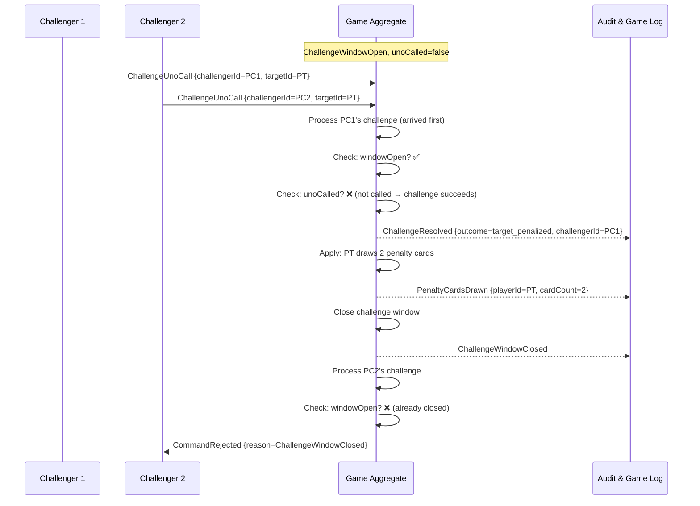
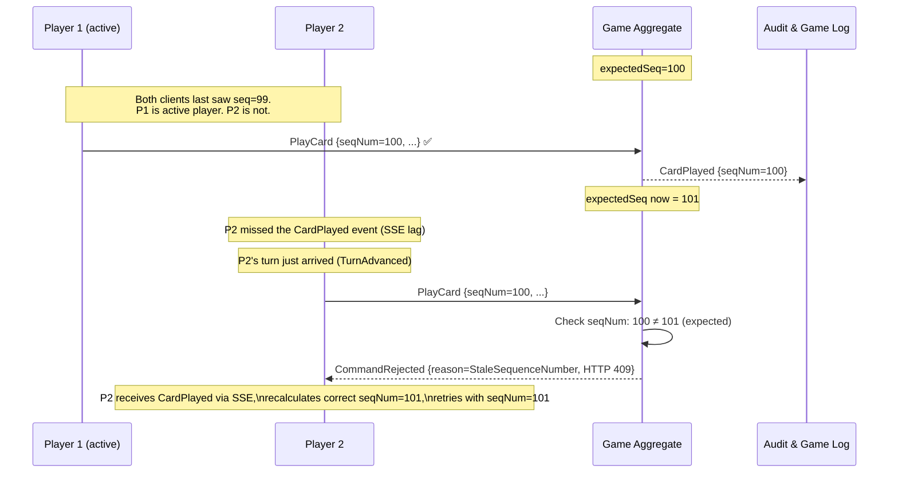

# Concurrent Action Resolution

Shows how the Game aggregate resolves simultaneous conflicting commands using sequence numbers and atomic processing.

## Scenario 1: Two Players Simultaneously Submit PlayCard

```mermaid
sequenceDiagram
    participant PA as Player A (active turn)
    participant PB as Player B (waiting)
    participant GA as Game Aggregate
    participant AL as Audit & Game Log

    Note over GA: state: activePlayerId=A, expectedSeq=42

    PA->>GA: PlayCard {playerId=A, cardId=C1, seqNum=42}
    PB->>GA: PlayCard {playerId=B, cardId=C2, seqNum=39}

    Note over GA: Commands arrive; processed ONE AT A TIME (serialized)

    GA->>GA: Process A's command first (arrived first)
    GA->>GA: Check: playerId==activePlayerId? ✅ A==A
    GA->>GA: Check: seqNum==expectedSeq? ✅ 42==42
    GA->>GA: Check: cardId in A's hand? ✅
    GA->>GA: Check: legal play? ✅
    GA->>GA: Apply: remove card from A's hand, update discard, increment seq to 43
    GA-->>AL: CardPlayed {playerId=A, card=C1, seqNum=42}

    GA->>GA: Process B's command
    GA->>GA: Check: playerId==activePlayerId? ❌ B≠A
    GA-->>PB: CommandRejected {reason=NotYourTurn, seqNum=42}

    Note over PB: PB receives CardPlayed via SSE, updates local state
```

## Scenario 2: Concurrent Uno Call and Challenge

```mermaid
sequenceDiagram
    participant PT as Target Player
    participant PC as Challenger
    participant GA as Game Aggregate
    participant AL as Audit & Game Log

    Note over GA: ChallengeWindowOpen, handSize(PT)=1\n windowDeadline = T+5s

    PT->>GA: CallUno {playerId=PT} [arrives at T+1.2s]
    PC->>GA: ChallengeUnoCall {challengerId=PC, targetId=PT} [arrives at T+1.3s]

    GA->>GA: Process CallUno (arrived first)
    GA->>GA: Set: unoCalled[PT] = true
    GA-->>AL: UnoCallMade {playerId=PT}
    GA-->>AL: ChallengeWindowClosed {reason=uno_called}

    GA->>GA: Process ChallengeUnoCall
    GA->>GA: Check: challengeWindowOpen? ❌ (already closed by UnoCallMade)
    GA-->>PC: CommandRejected {reason=ChallengeWindowClosed}

    Note over PC: Race condition — no penalty assessed; PC challenged in good faith within their perceived window
```

## Scenario 3: Two Simultaneous Challenges



## Scenario 4: Stale Sequence Number Under Concurrency



## Invariants Maintained Across All Scenarios

| Invariant | Enforcement Mechanism |
|---|---|
| Exactly one command processed at a time per Game | Serialized command processing (aggregate is single-writer) |
| Only the active player may play/draw | `activePlayerId` check before any state mutation |
| Sequence number advances monotonically | Reject any command with seqNum ≠ expectedSeq |
| At most one challenge resolution per window | `challengeWindowStatus` state checked before processing |
| CardPlayed appended to log before broadcast | Write-ahead to Game Log is the commit; broadcast is secondary |
| No command is applied twice | Idempotency key (`commandId`) checked before processing |
