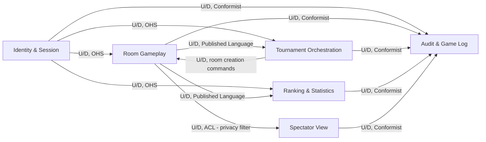

# Context Map

```mermaid
graph LR
    ID["Identity & Session"]
    RG["Room Gameplay"]
    TO["Tournament Orchestration"]
    RS["Ranking & Statistics"]
    SV["Spectator View"]
    AL["Audit & Game Log"]

    ID -->|"U/D, OHS"| RG
    ID -->|"U/D, OHS"| TO
    ID -->|"U/D, OHS"| RS
    ID -->|"U/D, Conformist"| AL

    RG -->|"U/D, Published Language"| TO
    RG -->|"U/D, Published Language"| RS
    RG -->|"U/D, ACL - privacy filter"| SV
    RG -->|"U/D, Conformist"| AL

    TO -->|"U/D, room creation commands"| RG
    TO -->|"U/D, Conformist"| AL

    RS -->|"U/D, Conformist"| AL

    SV -->|"U/D, Conformist"| AL
```
