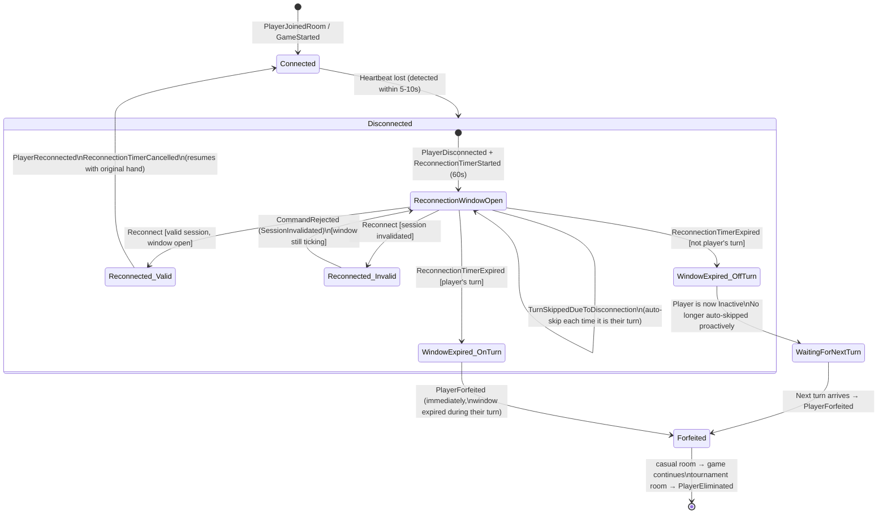
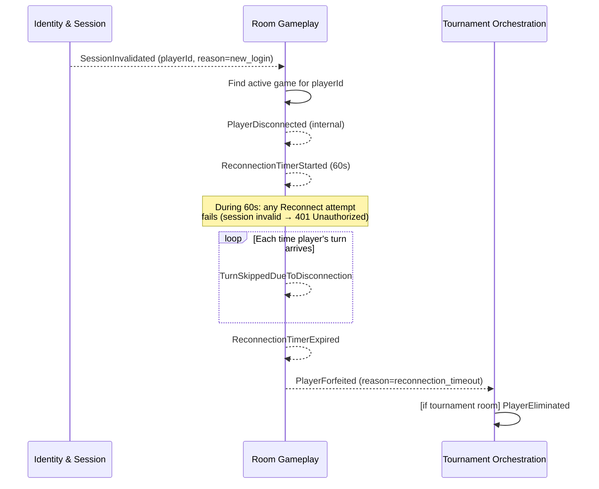

# Disconnection Handling Flow

This diagram shows all paths from disconnection through reconnection or forfeit.

## Disconnection Scenarios at a Glance

| When Disconnected | Window Expires On Turn? | Outcome |
|-------------------|------------------------|---------|
| During my turn | Yes (always) | Immediate PlayerForfeited on window expiry |
| Between turns | Yes (when rotation returns) | PlayerForfeited on next turn arrival |
| Between turns | No (reconnects before turn) | PlayerReconnected, game resumes |
| Session was invalidated | N/A | Reconnect always fails; window runs out; PlayerForfeited |

## Session Invalidation → Forced Forfeit Chain

