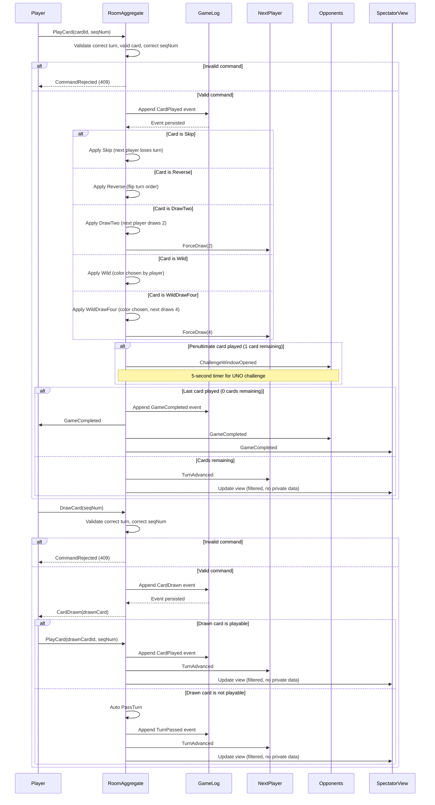

# Game Turn Sequence

```mermaid
sequenceDiagram
    participant Player
    participant RoomAggregate
    participant GameLog
    participant NextPlayer
    participant Opponents
    participant SpectatorView

    %% === Play Card Path ===
    Player->>RoomAggregate: PlayCard(cardId, seqNum)
    RoomAggregate->>RoomAggregate: Validate correct turn, valid card, correct seqNum

    alt Invalid command
        RoomAggregate-->>Player: CommandRejected (409)
    else Valid command
        RoomAggregate->>GameLog: Append CardPlayed event
        GameLog-->>RoomAggregate: Event persisted

        alt Card is Skip
            RoomAggregate->>RoomAggregate: Apply Skip (next player loses turn)
        else Card is Reverse
            RoomAggregate->>RoomAggregate: Apply Reverse (flip turn order)
        else Card is DrawTwo
            RoomAggregate->>RoomAggregate: Apply DrawTwo (next player draws 2)
            RoomAggregate->>NextPlayer: ForceDraw(2)
        else Card is Wild
            RoomAggregate->>RoomAggregate: Apply Wild (color chosen by player)
        else Card is WildDrawFour
            RoomAggregate->>RoomAggregate: Apply WildDrawFour (color chosen, next draws 4)
            RoomAggregate->>NextPlayer: ForceDraw(4)
        end

        alt Penultimate card played (1 card remaining)
            RoomAggregate->>Opponents: ChallengeWindowOpened
            Note over RoomAggregate,Opponents: 5-second timer for UNO challenge
        end

        alt Last card played (0 cards remaining)
            RoomAggregate->>GameLog: Append GameCompleted event
            RoomAggregate->>Player: GameCompleted
            RoomAggregate->>Opponents: GameCompleted
            RoomAggregate->>SpectatorView: GameCompleted
        else Cards remaining
            RoomAggregate->>NextPlayer: TurnAdvanced
            RoomAggregate->>SpectatorView: Update view (filtered, no private data)
        end
    end

    %% === Draw Card Path ===
    Player->>RoomAggregate: DrawCard(seqNum)
    RoomAggregate->>RoomAggregate: Validate correct turn, correct seqNum

    alt Invalid command
        RoomAggregate-->>Player: CommandRejected (409)
    else Valid command
        RoomAggregate->>GameLog: Append CardDrawn event
        GameLog-->>RoomAggregate: Event persisted
        RoomAggregate-->>Player: CardDrawn(drawnCard)

        alt Drawn card is playable
            Player->>RoomAggregate: PlayCard(drawnCardId, seqNum)
            RoomAggregate->>GameLog: Append CardPlayed event
            RoomAggregate->>NextPlayer: TurnAdvanced
            RoomAggregate->>SpectatorView: Update view (filtered, no private data)
        else Drawn card is not playable
            RoomAggregate->>RoomAggregate: Auto PassTurn
            RoomAggregate->>GameLog: Append TurnPassed event
            RoomAggregate->>NextPlayer: TurnAdvanced
            RoomAggregate->>SpectatorView: Update view (filtered, no private data)
        end
    end
```
