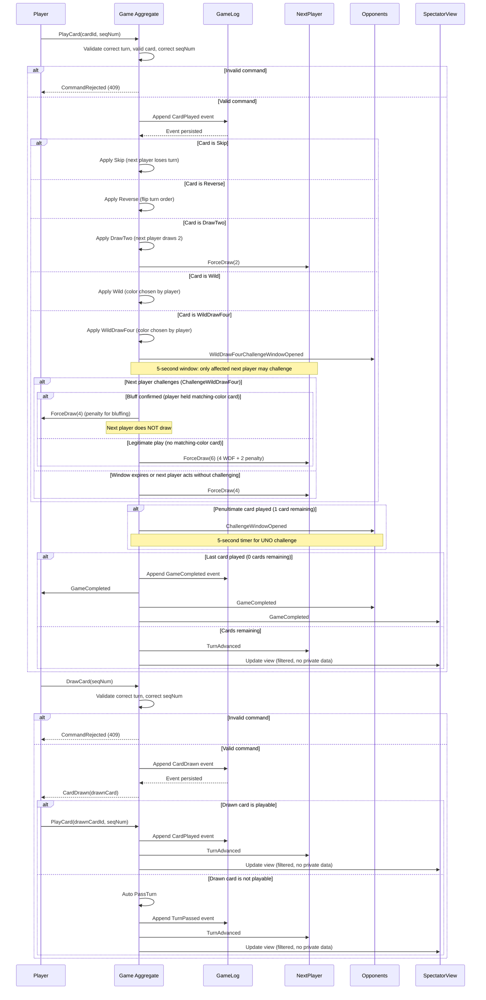

# Game Turn Sequence

```mermaid
sequenceDiagram
    participant Player
    participant GameAggregate as Game Aggregate
    participant GameLog
    participant NextPlayer
    participant Opponents
    participant SpectatorView

    %% === Play Card Path ===
    Player->>GameAggregate: PlayCard(cardId, seqNum)
    GameAggregate->>GameAggregate: Validate correct turn, valid card, correct seqNum

    alt Invalid command
        GameAggregate-->>Player: CommandRejected (409)
    else Valid command
        GameAggregate->>GameLog: Append CardPlayed event
        GameLog-->>GameAggregate: Event persisted

        alt Card is Skip
            GameAggregate->>GameAggregate: Apply Skip (next player loses turn)
        else Card is Reverse
            GameAggregate->>GameAggregate: Apply Reverse (flip turn order)
        else Card is DrawTwo
            GameAggregate->>GameAggregate: Apply DrawTwo (next player draws 2)
            GameAggregate->>NextPlayer: ForceDraw(2)
        else Card is Wild
            GameAggregate->>GameAggregate: Apply Wild (color chosen by player)
        else Card is WildDrawFour
            GameAggregate->>GameAggregate: Apply WildDrawFour (color chosen by player)
            GameAggregate->>Opponents: WildDrawFourChallengeWindowOpened
            Note over GameAggregate,NextPlayer: 5-second window: only affected next player may challenge
            alt Next player challenges (ChallengeWildDrawFour)
                alt Bluff confirmed (player held matching-color card)
                    GameAggregate->>Player: ForceDraw(4) (penalty for bluffing)
                    Note over GameAggregate: Next player does NOT draw
                else Legitimate play (no matching-color card)
                    GameAggregate->>NextPlayer: ForceDraw(6) (4 WDF + 2 penalty)
                end
            else Window expires or next player acts without challenging
                GameAggregate->>NextPlayer: ForceDraw(4)
            end
        end

        alt Penultimate card played (1 card remaining)
            GameAggregate->>Opponents: ChallengeWindowOpened
            Note over GameAggregate,Opponents: 5-second timer for UNO challenge
        end

        alt Last card played (0 cards remaining)
            GameAggregate->>GameLog: Append GameCompleted event
            GameAggregate->>Player: GameCompleted
            GameAggregate->>Opponents: GameCompleted
            GameAggregate->>SpectatorView: GameCompleted
        else Cards remaining
            GameAggregate->>NextPlayer: TurnAdvanced
            GameAggregate->>SpectatorView: Update view (filtered, no private data)
        end
    end

    %% === Draw Card Path ===
    Player->>GameAggregate: DrawCard(seqNum)
    GameAggregate->>GameAggregate: Validate correct turn, correct seqNum

    alt Invalid command
        GameAggregate-->>Player: CommandRejected (409)
    else Valid command
        GameAggregate->>GameLog: Append CardDrawn event
        GameLog-->>GameAggregate: Event persisted
        GameAggregate-->>Player: CardDrawn(drawnCard)

        alt Drawn card is playable
            Player->>GameAggregate: PlayCard(drawnCardId, seqNum)
            GameAggregate->>GameLog: Append CardPlayed event
            GameAggregate->>NextPlayer: TurnAdvanced
            GameAggregate->>SpectatorView: Update view (filtered, no private data)
        else Drawn card is not playable
            GameAggregate->>GameAggregate: Auto PassTurn
            GameAggregate->>GameLog: Append TurnPassed event
            GameAggregate->>NextPlayer: TurnAdvanced
            GameAggregate->>SpectatorView: Update view (filtered, no private data)
        end
    end
```
