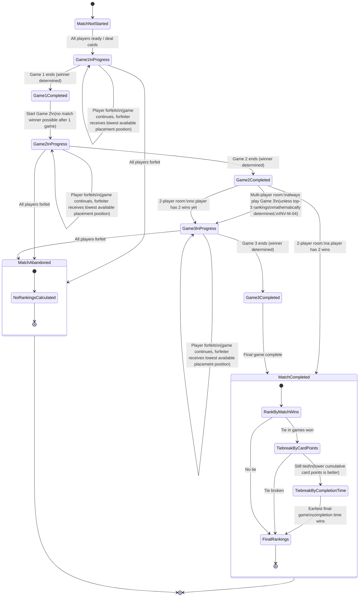

# Match Lifecycle (Best-of-Three)

```mermaid
stateDiagram-v2
    [*] --> MatchNotStarted

    MatchNotStarted --> Game1InProgress : All players ready / deal cards

    Game1InProgress --> Game1Completed : Game 1 ends (winner determined)
    Game1InProgress --> Game1InProgress : Player forfeits\n(game continues, forfeiter receives lowest available placement position)
    Game1InProgress --> MatchAbandoned : All players forfeit

    Game1Completed --> Game2InProgress : Start Game 2\n(no match winner possible after 1 game)

    Game2InProgress --> Game2Completed : Game 2 ends (winner determined)
    Game2InProgress --> Game2InProgress : Player forfeits\n(game continues, forfeiter receives lowest available placement position)
    Game2InProgress --> MatchAbandoned : All players forfeit

    Game2Completed --> MatchCompleted : 2-player room:\na player has 2 wins
    Game2Completed --> Game3InProgress : Multi-player room:\nalways play Game 3\n(unless top-3 rankings\nmathematically determined,\nINV-M-04)
    Game2Completed --> Game3InProgress : 2-player room:\nno player has 2 wins yet

    Game3InProgress --> Game3Completed : Game 3 ends (winner determined)
    Game3InProgress --> Game3InProgress : Player forfeits\n(game continues, forfeiter receives lowest available placement position)
    Game3InProgress --> MatchAbandoned : All players forfeit

    Game3Completed --> MatchCompleted : Final game complete

    MatchCompleted --> [*]
    MatchAbandoned --> [*]

    state MatchCompleted {
        [*] --> RankByMatchWins
        RankByMatchWins --> TiebreakByCardPoints : Tie in games won
        RankByMatchWins --> FinalRankings : No tie
        TiebreakByCardPoints --> TiebreakByCompletionTime : Still tied\n(lower cumulative card points is better)
        TiebreakByCardPoints --> FinalRankings : Tie broken
        TiebreakByCompletionTime --> FinalRankings : Earliest final-game\ncompletion time wins
        FinalRankings --> [*]
    }

    state MatchAbandoned {
        [*] --> NoRankingsCalculated
        NoRankingsCalculated --> [*]
    }
```
