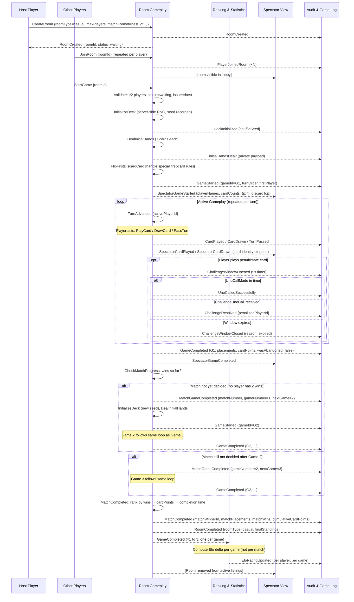

# Room Creation to Completion

End-to-end sequence for a casual room through the full best-of-3 match lifecycle.



## State Machine Summary

```
Room: Waiting → In-Progress → Completed
Match: [G1 started] → [G1 done] → [G2 started?] → [G2 done] → [G3 started?] → [G3 done] → MatchCompleted
Game:  AwaitingAction → [CardPlayed/Drawn] → [ChallengeWindowOpen?] → AwaitingAction → ... → GameCompleted
```
