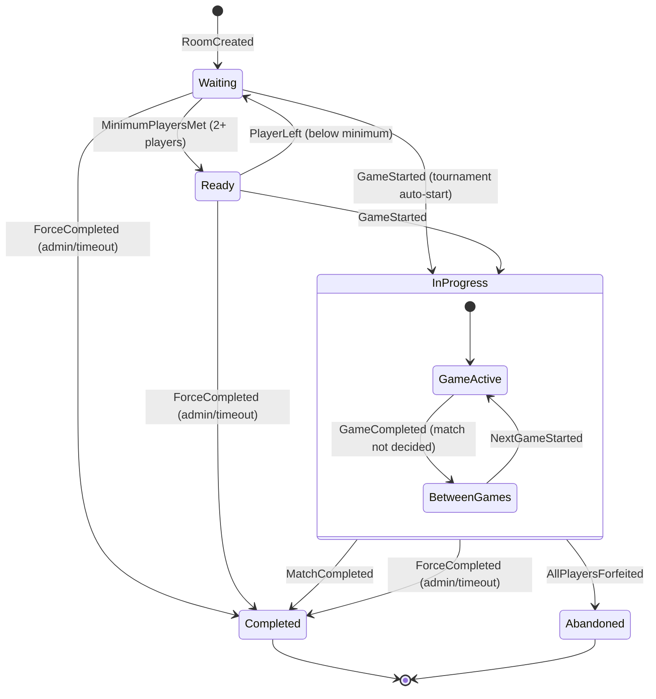

# Room Lifecycle State Machine

```mermaid
stateDiagram-v2
    [*] --> Waiting : RoomCreated

    Waiting --> Ready : MinimumPlayersMet (2+ players)
    Waiting --> InProgress : GameStarted (tournament auto-start)

    Ready --> Waiting : PlayerLeft (below minimum)
    Ready --> InProgress : GameStarted

    state InProgress {
        [*] --> GameActive
        GameActive --> BetweenGames : GameCompleted (match not decided)
        BetweenGames --> GameActive : NextGameStarted
    }

    InProgress --> Completed : MatchCompleted
    InProgress --> Abandoned : AllPlayersForfeited

    Waiting --> Completed : ForceCompleted (admin/timeout)
    Ready --> Completed : ForceCompleted (admin/timeout)
    InProgress --> Completed : ForceCompleted (admin/timeout)

    Completed --> [*]
    Abandoned --> [*]
```
