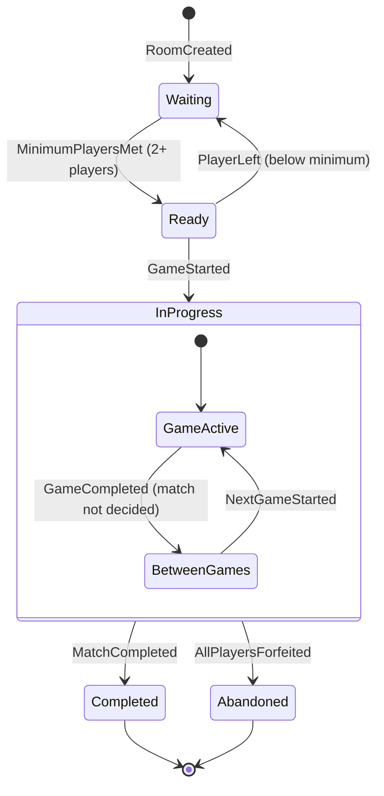

# Room Lifecycle State Machine

```mermaid
stateDiagram-v2
    [*] --> Waiting : RoomCreated

    Waiting --> Ready : MinimumPlayersMet (2+ players)
    %% Tournament rooms follow the same path: auto-join triggers MinimumPlayersMet → Ready, then auto-StartMatch → InProgress

    Ready --> Waiting : PlayerLeft (below minimum)
    Ready --> InProgress : GameStarted

    state InProgress {
        [*] --> GameActive
        GameActive --> BetweenGames : GameCompleted (match not decided)
        BetweenGames --> GameActive : NextGameStarted
    }

    InProgress --> Completed : MatchCompleted
    InProgress --> Abandoned : AllPlayersForfeited

    Completed --> [*]
    Abandoned --> [*]
```
