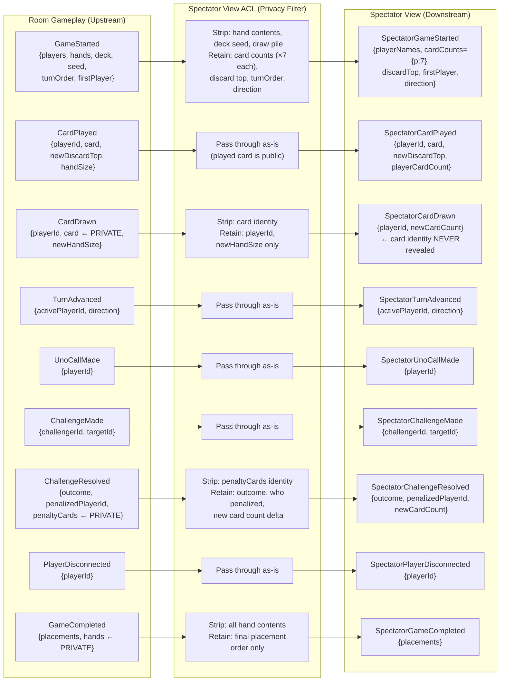

# Spectator Projection (Anti-Corruption Layer)

Shows how Room Gameplay events are transformed through the ACL before reaching the Spectator View projection.

## Data Classification: Public vs. Private

| Data Element | Classification | Rationale |
|---|---|---|
| Player display names | Public | Needed for spectator context |
| Card count per player (integer) | Public | Shows game progress without revealing strategy |
| Discard pile top card | Public | Defines legal play; spectators can see it |
| Turn indicator (whose turn) | Public | Core gameplay visibility |
| Play direction (CW / CCW) | Public | Observable game state |
| Uno call events | Public | Observable action |
| Challenge events and outcomes | Public | Observable action and result |
| Match score (games won) | Public | Tournament and match context |
| Player connection status | Public | Observable game state |
| **Hand contents (card identities)** | **PRIVATE** | Core rule: no spectator sees another player's hand |
| **Drawn card identity** | **PRIVATE** | Revealing drawn card = revealing part of hand |
| **Draw pile contents/order** | **PRIVATE** | Would allow prediction of future draws |
| **Deck seed / RNG state** | **PRIVATE** | Would allow full hand reconstruction |
| **Penalty card identities** | **PRIVATE** | Added to hand → private |
| **Sequence numbers** | **Private** (implementation) | Internal concurrency control; not spectator-relevant |

## ACL Ownership

The ACL is owned by the **Spectator View context**, not by Room Gameplay. Room Gameplay publishes its full, unfiltered event stream. The Spectator View's ACL is responsible for all privacy enforcement. Room Gameplay has no knowledge of or responsibility for spectator concerns.
