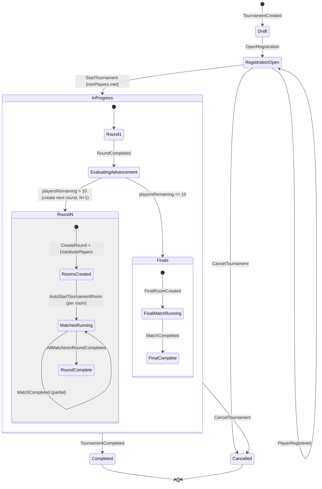

# Tournament Progression

## Player Count Reduction per Round

With rooms of up to 10 players and top 3 advancing, each round reduces the pool by ~70%.

| Starting Players | Round 1 Rooms | Advance | Round 2 Rooms | ... | Rounds to Final |
|-----------------|--------------|---------|--------------|-----|-----------------|
| 1,000,000       | ~100,000     | 300,000 | ~30,000      | ... | ~11             |
| 100,000         | ~10,000      | 30,000  | ~3,000       | ... | ~9              |
| 10,000          | ~1,000       | 3,000   | ~300         | ... | ~7              |
| 1,000           | ~100         | 300     | ~30          | ... | ~5              |
| 100             | ~10          | 30      | ~3           | ... | ~3              |
| 10              | 1 (Final)    | —       | —            | ... | 1 (Final)       |

Formula: `rounds ≈ ceil(log(playerCount) / log(10/3))`
