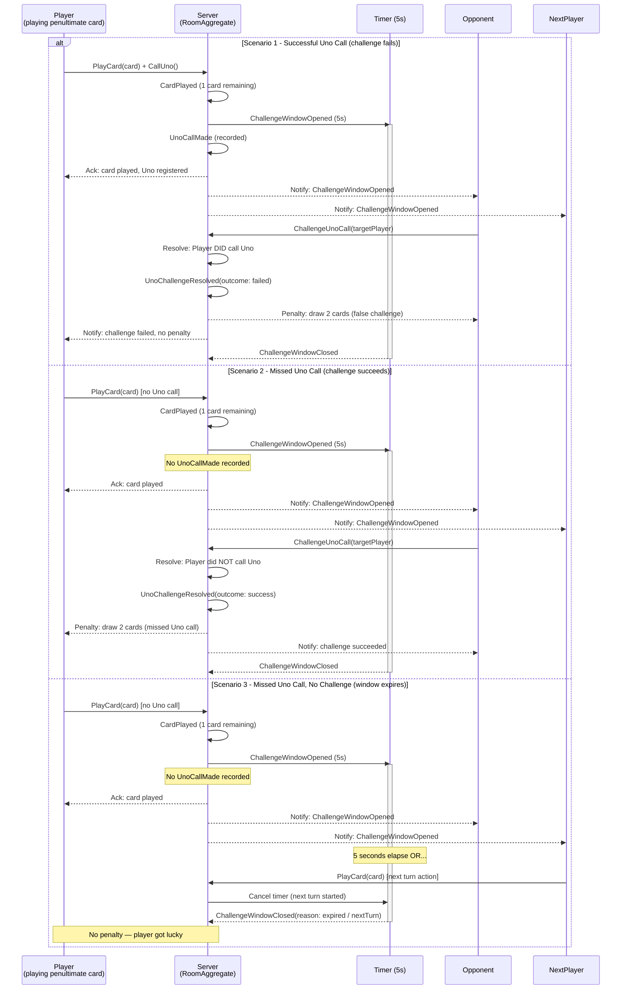

# Uno Call Timing Mechanics

```mermaid
sequenceDiagram
    participant Player as Player<br/>(playing penultimate card)
    participant Server as Server<br/>(RoomAggregate)
    participant Timer as Timer (5s)
    participant Opponent as Opponent
    participant NextPlayer as NextPlayer

    alt Scenario 1 - Successful Uno Call (challenge fails)
        Player->>Server: PlayCard(card) + CallUno()
        Server->>Server: CardPlayed (1 card remaining)
        Server->>Timer: ChallengeWindowOpened (5s)
        activate Timer
        Server->>Server: UnoCallMade (recorded)
        Server-->>Player: Ack: card played, Uno registered
        Server-->>Opponent: Notify: ChallengeWindowOpened
        Server-->>NextPlayer: Notify: ChallengeWindowOpened

        Opponent->>Server: ChallengeUnoCall(targetPlayer)
        Server->>Server: Resolve: Player DID call Uno
        Server->>Server: UnoChallengeResolved(outcome: failed)
        Server-->>Opponent: Penalty: draw 2 cards (false challenge)
        Server-->>Player: Notify: challenge failed, no penalty

        Timer-->>Server: ChallengeWindowClosed
        deactivate Timer

    else Scenario 2 - Missed Uno Call (challenge succeeds)
        Player->>Server: PlayCard(card) [no Uno call]
        Server->>Server: CardPlayed (1 card remaining)
        Server->>Timer: ChallengeWindowOpened (5s)
        activate Timer
        Note over Server: No UnoCallMade recorded
        Server-->>Player: Ack: card played
        Server-->>Opponent: Notify: ChallengeWindowOpened
        Server-->>NextPlayer: Notify: ChallengeWindowOpened

        Opponent->>Server: ChallengeUnoCall(targetPlayer)
        Server->>Server: Resolve: Player did NOT call Uno
        Server->>Server: UnoChallengeResolved(outcome: success)
        Server-->>Player: Penalty: draw 2 cards (missed Uno call)
        Server-->>Opponent: Notify: challenge succeeded

        Timer-->>Server: ChallengeWindowClosed
        deactivate Timer

    else Scenario 3 - Missed Uno Call, No Challenge (window expires)
        Player->>Server: PlayCard(card) [no Uno call]
        Server->>Server: CardPlayed (1 card remaining)
        Server->>Timer: ChallengeWindowOpened (5s)
        activate Timer
        Note over Server: No UnoCallMade recorded
        Server-->>Player: Ack: card played
        Server-->>Opponent: Notify: ChallengeWindowOpened
        Server-->>NextPlayer: Notify: ChallengeWindowOpened

        Note over Timer: 5 seconds elapse OR...
        NextPlayer->>Server: PlayCard(card) [next turn action]
        Server->>Timer: Cancel timer (next turn started)
        Timer-->>Server: ChallengeWindowClosed(reason: expired / nextTurn)
        deactivate Timer
        Note over Server,Player: No penalty — player got lucky
    end
```
